# SmartSure Platform  Low-Level Design (LLD)

**Version:** 2.0
**Stack:** .NET 10  Angular 17  SQL Server  RabbitMQ  Ocelot

---

## Table of Contents

1. Entity Relationship Diagrams
2. Class Diagrams  All Services
3. Sequence Diagrams  All Key Flows
4. State Machine Diagrams
5. Component & Layer Diagrams
6. API Contract Details
7. Database Schema Details
8. Caching & Memory Design
9. Error Handling Design
10. Security Design Details

---
## 1. Entity Relationship Diagrams

### 1.1 IdentityService  AuthDb

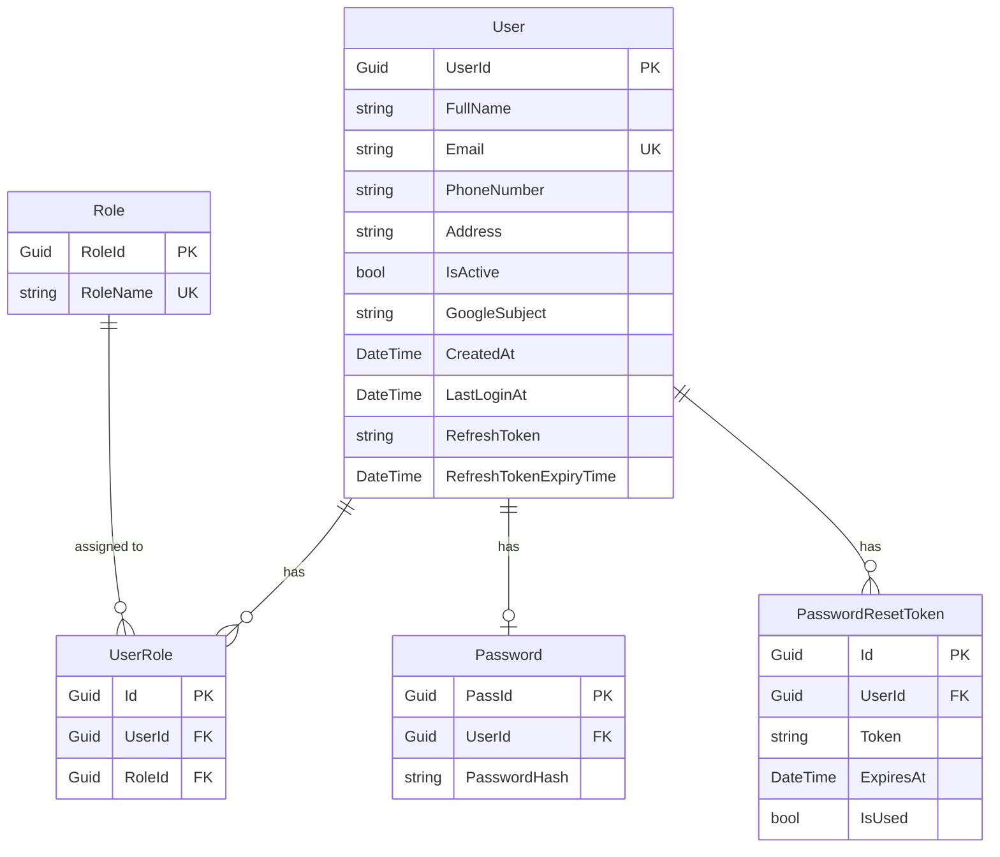
```mermaid
erDiagram
    User {
        Guid UserId PK
        string FullName
        string Email UK
        string PhoneNumber
        string Address
        bool IsActive
        string GoogleSubject
        DateTime CreatedAt
        DateTime LastLoginAt
        string RefreshToken
        DateTime RefreshTokenExpiryTime
    }
    Password {
        Guid PassId PK
        Guid UserId FK
        string PasswordHash
    }
    Role {
        Guid RoleId PK
        string RoleName UK
    }
    UserRole {
        Guid Id PK
        Guid UserId FK
        Guid RoleId FK
    }
    PasswordResetToken {
        Guid Id PK
        Guid UserId FK
        string Token
        DateTime ExpiresAt
        bool IsUsed
    }

    User ||--o{ UserRole : "has"
    Role ||--o{ UserRole : "assigned to"
    User ||--o| Password : "has"
    User ||--o{ PasswordResetToken : "has"
```

### 1.2 PolicyService  PolicyDb

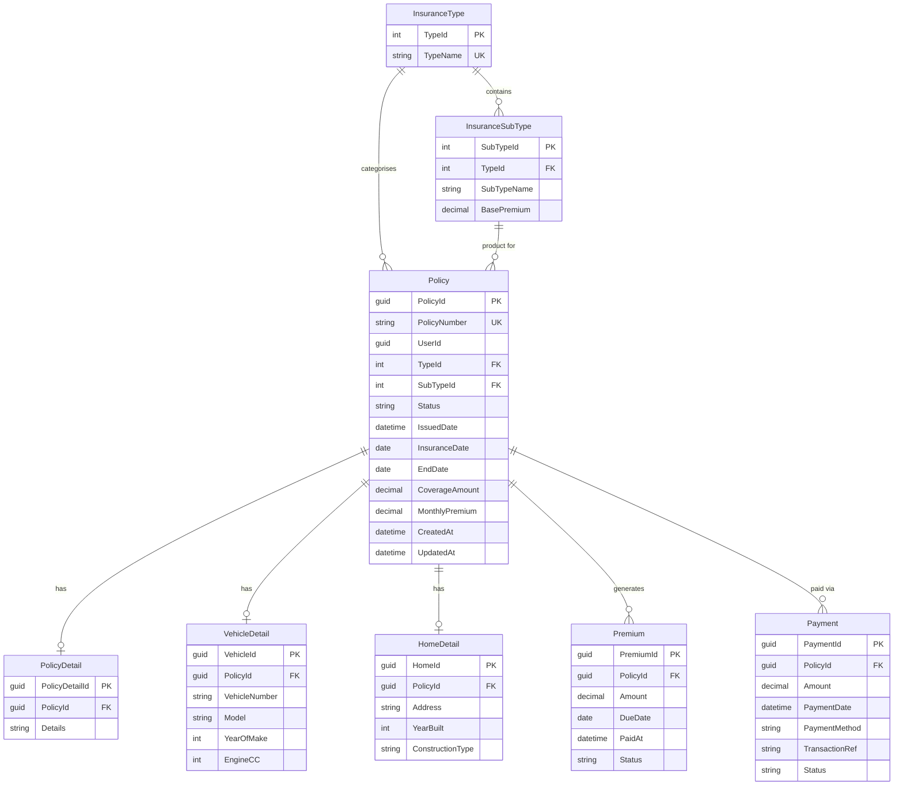
```mermaid
erDiagram
    InsuranceType {
        int TypeId PK
        string TypeName UK
    }
    InsuranceSubType {
        int SubTypeId PK
        int TypeId FK
        string SubTypeName
        decimal BasePremium
    }
    Policy {
        guid PolicyId PK
        string PolicyNumber UK
        guid UserId
        int TypeId FK
        int SubTypeId FK
        string Status
        datetime IssuedDate
        date InsuranceDate
        date EndDate
        decimal CoverageAmount
        decimal MonthlyPremium
        datetime CreatedAt
        datetime UpdatedAt
    }
    PolicyDetail {
        guid PolicyDetailId PK
        guid PolicyId FK
        string Details
    }
    VehicleDetail {
        guid VehicleId PK
        guid PolicyId FK
        string VehicleNumber
        string Model
        int YearOfMake
        int EngineCC
    }
    HomeDetail {
        guid HomeId PK
        guid PolicyId FK
        string Address
        int YearBuilt
        string ConstructionType
    }
    Premium {
        guid PremiumId PK
        guid PolicyId FK
        decimal Amount
        date DueDate
        datetime PaidAt
        string Status
    }
    Payment {
        guid PaymentId PK
        guid PolicyId FK
        decimal Amount
        datetime PaymentDate
        string PaymentMethod
        string TransactionRef
        string Status
    }

    InsuranceType ||--o{ InsuranceSubType : "contains"
    InsuranceType ||--o{ Policy : "categorises"
    InsuranceSubType ||--o{ Policy : "product for"
    Policy ||--o| PolicyDetail : "has"
    Policy ||--o| VehicleDetail : "has"
    Policy ||--o| HomeDetail : "has"
    Policy ||--o{ Premium : "generates"
    Policy ||--o{ Payment : "paid via"
```

#### Class Diagram: PolicyService

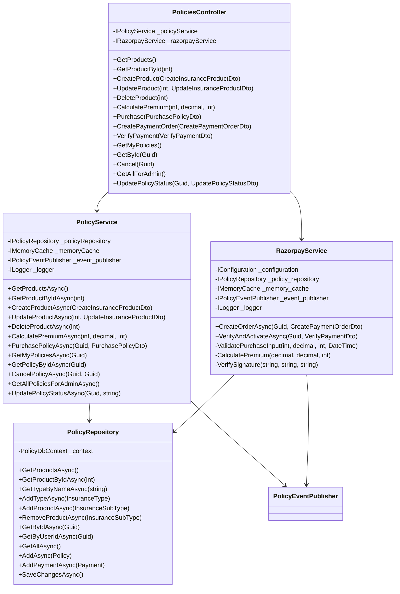
```mermaid
classDiagram
    class PoliciesController {
        -IPolicyService _policyService
        -IRazorpayService _razorpayService
        +GetProducts()
        +GetProductById(int)
        +CreateProduct(CreateInsuranceProductDto)
        +UpdateProduct(int, UpdateInsuranceProductDto)
        +DeleteProduct(int)
        +CalculatePremium(int, decimal, int)
        +Purchase(PurchasePolicyDto)
        +CreatePaymentOrder(CreatePaymentOrderDto)
        +VerifyPayment(VerifyPaymentDto)
        +GetMyPolicies()
        +GetById(Guid)
        +Cancel(Guid)
        +GetAllForAdmin()
        +UpdatePolicyStatus(Guid, UpdatePolicyStatusDto)
    }

    class PolicyService {
        -IPolicyRepository _policyRepository
        -IMemoryCache _memoryCache
        -IPolicyEventPublisher _event_publisher
        -ILogger _logger
        +GetProductsAsync()
        +GetProductByIdAsync(int)
        +CreateProductAsync(CreateInsuranceProductDto)
        +UpdateProductAsync(int, UpdateInsuranceProductDto)
        +DeleteProductAsync(int)
        +CalculatePremiumAsync(int, decimal, int)
        +PurchasePolicyAsync(Guid, PurchasePolicyDto)
        +GetMyPoliciesAsync(Guid)
        +GetPolicyByIdAsync(Guid)
        +CancelPolicyAsync(Guid, Guid)
        +GetAllPoliciesForAdminAsync()
        +UpdatePolicyStatusAsync(Guid, string)
    }

    class RazorpayService {
        -IConfiguration _configuration
        -IPolicyRepository _policy_repository
        -IMemoryCache _memory_cache
        -IPolicyEventPublisher _event_publisher
        -ILogger _logger
        +CreateOrderAsync(Guid, CreatePaymentOrderDto)
        +VerifyAndActivateAsync(Guid, VerifyPaymentDto)
        -ValidatePurchaseInput(int, decimal, int, DateTime)
        -CalculatePremium(decimal, decimal, int)
        -VerifySignature(string, string, string)
    }

    class PolicyRepository {
        -PolicyDbContext _context
        +GetProductsAsync()
        +GetProductByIdAsync(int)
        +GetTypeByNameAsync(string)
        +AddTypeAsync(InsuranceType)
        +AddProductAsync(InsuranceSubType)
        +RemoveProductAsync(InsuranceSubType)
        +GetByIdAsync(Guid)
        +GetByUserIdAsync(Guid)
        +GetAllAsync()
        +AddAsync(Policy)
        +AddPaymentAsync(Payment)
        +SaveChangesAsync()
    }

    PoliciesController --> PolicyService
    PoliciesController --> RazorpayService
    PolicyService --> PolicyRepository
    PolicyService --> PolicyEventPublisher
    RazorpayService --> PolicyRepository
    RazorpayService --> PolicyEventPublisher
```

#### Sequence Diagram: Policy Purchase (Razorpay)

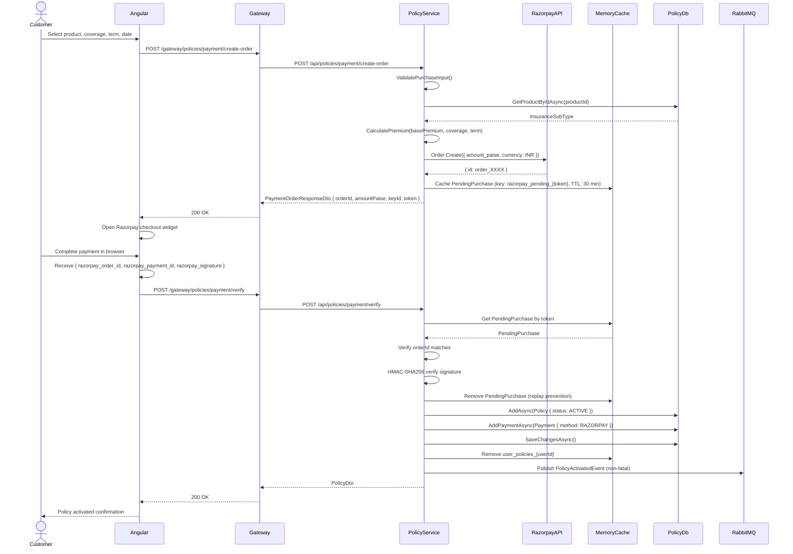
```mermaid
sequenceDiagram
    actor Customer
    participant Angular
    participant Gateway
    participant PolicyService
    participant RazorpayAPI
    participant MemoryCache
    participant PolicyDb
    participant RabbitMQ

    Customer->>Angular: Select product, coverage, term, date
    Angular->>Gateway: POST /gateway/policies/payment/create-order
    Gateway->>PolicyService: POST /api/policies/payment/create-order
    PolicyService->>PolicyService: ValidatePurchaseInput()
    PolicyService->>PolicyDb: GetProductByIdAsync(productId)
    PolicyDb-->>PolicyService: InsuranceSubType
    PolicyService->>PolicyService: CalculatePremium(basePremium, coverage, term)
    PolicyService->>RazorpayAPI: Order.Create({ amount_paise, currency: INR })
    RazorpayAPI-->>PolicyService: { id: order_XXXX }
    PolicyService->>MemoryCache: Cache PendingPurchase (key: razorpay_pending_{token}, TTL: 30 min)
    PolicyService-->>Gateway: PaymentOrderResponseDto { orderId, amountPaise, keyId, token }
    Gateway-->>Angular: 200 OK

    Angular->>Angular: Open Razorpay checkout widget
    Customer->>Angular: Complete payment in browser
    Angular->>Angular: Receive { razorpay_order_id, razorpay_payment_id, razorpay_signature }

    Angular->>Gateway: POST /gateway/policies/payment/verify
    Gateway->>PolicyService: POST /api/policies/payment/verify
    PolicyService->>MemoryCache: Get PendingPurchase by token
    MemoryCache-->>PolicyService: PendingPurchase
    PolicyService->>PolicyService: Verify orderId matches
    PolicyService->>PolicyService: HMAC-SHA256 verify signature
    PolicyService->>MemoryCache: Remove PendingPurchase (replay prevention)
    PolicyService->>PolicyDb: AddAsync(Policy { status: ACTIVE })
    PolicyService->>PolicyDb: AddPaymentAsync(Payment { method: RAZORPAY })
    PolicyService->>PolicyDb: SaveChangesAsync()
    PolicyService->>MemoryCache: Remove user_policies_{userId}
    PolicyService->>RabbitMQ: Publish PolicyActivatedEvent (non-fatal)
    PolicyService-->>Gateway: PolicyDto
    Gateway-->>Angular: 200 OK
    Angular-->>Customer: Policy activated confirmation
```

#### Sequence Diagram: Policy Cancellation

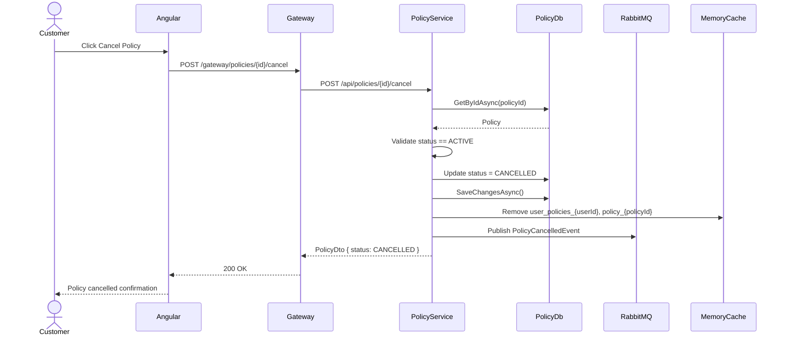
```mermaid
sequenceDiagram
    actor Customer
    participant Angular
    participant Gateway
    participant PolicyService
    participant PolicyDb
    participant RabbitMQ

    Customer->>Angular: Click Cancel Policy
    Angular->>Gateway: POST /gateway/policies/{id}/cancel
    Gateway->>PolicyService: POST /api/policies/{id}/cancel
    PolicyService->>PolicyDb: GetByIdAsync(policyId)
    PolicyDb-->>PolicyService: Policy
    PolicyService->>PolicyService: Validate status == ACTIVE
    PolicyService->>PolicyDb: Update status = CANCELLED
    PolicyService->>PolicyDb: SaveChangesAsync()
    PolicyService->>MemoryCache: Remove user_policies_{userId}, policy_{policyId}
    PolicyService->>RabbitMQ: Publish PolicyCancelledEvent
    PolicyService-->>Gateway: PolicyDto { status: CANCELLED }
    Gateway-->>Angular: 200 OK
    Angular-->>Customer: Policy cancelled confirmation
```

#### Use Case Diagram: PolicyService

```mermaid
%%{init: { 'theme': 'default' } }%%
graph TD
    Customer((Customer))
    Admin((Admin))
    subgraph UseCases
        PurchasePolicy([Purchase Policy])
        ViewMyPolicies([View My Policies])
        CancelPolicy([Cancel Policy])
        ViewPolicyDetails([View Policy Details])
        CreateProduct([Create Product])
        UpdateProduct([Update Product])
        DeleteProduct([Delete Product])
        ViewAllPolicies([View All Policies])
        UpdatePolicyStatus([Update Policy Status])
    end
    Customer -- PurchasePolicy
    Customer -- ViewMyPolicies
    Customer -- CancelPolicy
    Customer -- ViewPolicyDetails
    Admin -- CreateProduct
    Admin -- UpdateProduct
    Admin -- DeleteProduct
    Admin -- ViewAllPolicies
    Admin -- UpdatePolicyStatus
```

### 1.3 ClaimsService  ClaimsDb

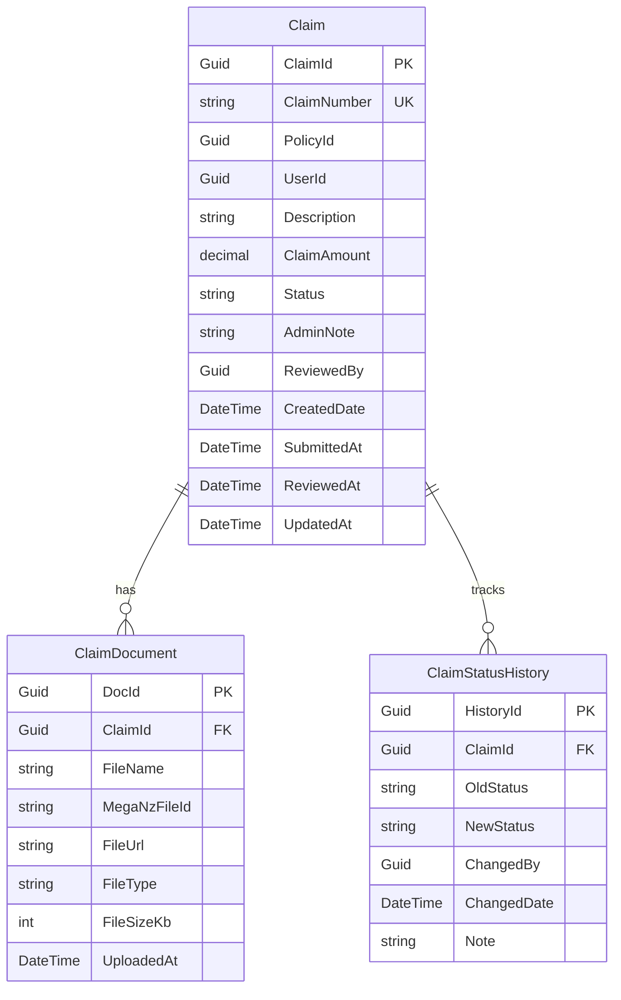
```mermaid
erDiagram
    Claim {
        Guid ClaimId PK
        string ClaimNumber UK
        Guid PolicyId
        Guid UserId
        string Description
        decimal ClaimAmount
        string Status
        string AdminNote
        Guid ReviewedBy
        DateTime CreatedDate
        DateTime SubmittedAt
        DateTime ReviewedAt
        DateTime UpdatedAt
    }
    ClaimDocument {
        Guid DocId PK
        Guid ClaimId FK
        string FileName
        string MegaNzFileId
        string FileUrl
        string FileType
        int FileSizeKb
        DateTime UploadedAt
    }
    ClaimStatusHistory {
        Guid HistoryId PK
        Guid ClaimId FK
        string OldStatus
        string NewStatus
        Guid ChangedBy
        DateTime ChangedDate
        string Note
    }

    Claim ||--o{ ClaimDocument : "has"
    Claim ||--o{ ClaimStatusHistory : "tracks"
```

### 1.4 AdminService  AdminDb

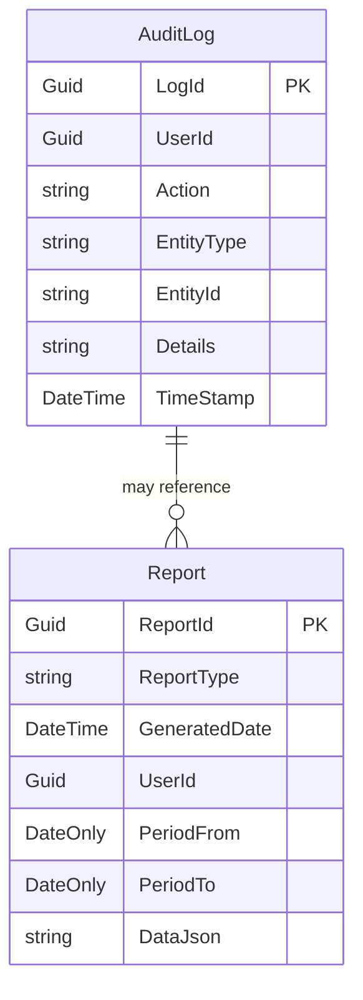
```mermaid
erDiagram
    AuditLog {
        Guid LogId PK
        Guid UserId
        string Action
        string EntityType
        string EntityId
        string Details
        DateTime TimeStamp
    }
    Report {
        Guid ReportId PK
        string ReportType
        DateTime GeneratedDate
        Guid UserId
        DateOnly PeriodFrom
        DateOnly PeriodTo
        string DataJson
    }

    AuditLog ||--o{ Report : "may reference"
```

---
## 2. Class Diagrams

### 2.1 IdentityService

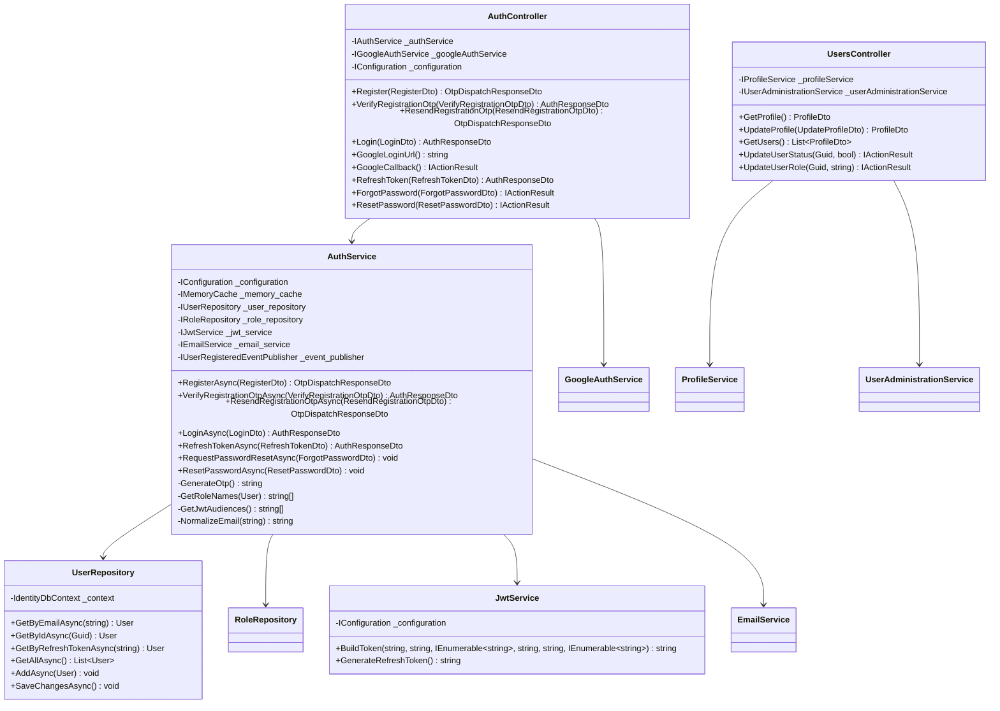
```mermaid
classDiagram
    class AuthController {
        -IAuthService _authService
        -IGoogleAuthService _googleAuthService
        -IConfiguration _configuration
        +Register(RegisterDto) OtpDispatchResponseDto
        +VerifyRegistrationOtp(VerifyRegistrationOtpDto) AuthResponseDto
        +ResendRegistrationOtp(ResendRegistrationOtpDto) OtpDispatchResponseDto
        +Login(LoginDto) AuthResponseDto
        +GoogleLoginUrl() string
        +GoogleCallback() IActionResult
        +RefreshToken(RefreshTokenDto) AuthResponseDto
        +ForgotPassword(ForgotPasswordDto) IActionResult
        +ResetPassword(ResetPasswordDto) IActionResult
    }

    class UsersController {
        -IProfileService _profileService
        -IUserAdministrationService _userAdministrationService
        +GetProfile() ProfileDto
        +UpdateProfile(UpdateProfileDto) ProfileDto
        +GetUsers() List~ProfileDto~
        +UpdateUserStatus(Guid, bool) IActionResult
        +UpdateUserRole(Guid, string) IActionResult
    }

    class AuthService {
        -IConfiguration _configuration
        -IMemoryCache _memory_cache
        -IUserRepository _user_repository
        -IRoleRepository _role_repository
        -IJwtService _jwt_service
        -IEmailService _email_service
        -IUserRegisteredEventPublisher _event_publisher
        +RegisterAsync(RegisterDto) OtpDispatchResponseDto
        +VerifyRegistrationOtpAsync(VerifyRegistrationOtpDto) AuthResponseDto
        +ResendRegistrationOtpAsync(ResendRegistrationOtpDto) OtpDispatchResponseDto
        +LoginAsync(LoginDto) AuthResponseDto
        +RefreshTokenAsync(RefreshTokenDto) AuthResponseDto
        +RequestPasswordResetAsync(ForgotPasswordDto) void
        +ResetPasswordAsync(ResetPasswordDto) void
        -GenerateOtp() string
        -GetRoleNames(User) string[]
        -GetJwtAudiences() string[]
        -NormalizeEmail(string) string
    }

    class JwtService {
        -IConfiguration _configuration
        +BuildToken(string, string, IEnumerable~string~, string, string, IEnumerable~string~) string
        +GenerateRefreshToken() string
    }

    class UserRepository {
        -IdentityDbContext _context
        +GetByEmailAsync(string) User
        +GetByIdAsync(Guid) User
        +GetByRefreshTokenAsync(string) User
        +GetAllAsync() List~User~
        +AddAsync(User) void
        +SaveChangesAsync() void
    }

    AuthController --> AuthService
    AuthController --> GoogleAuthService
    UsersController --> ProfileService
    UsersController --> UserAdministrationService
    AuthService --> UserRepository
    AuthService --> RoleRepository
    AuthService --> JwtService
    AuthService --> EmailService
```

### 2.2 PolicyService

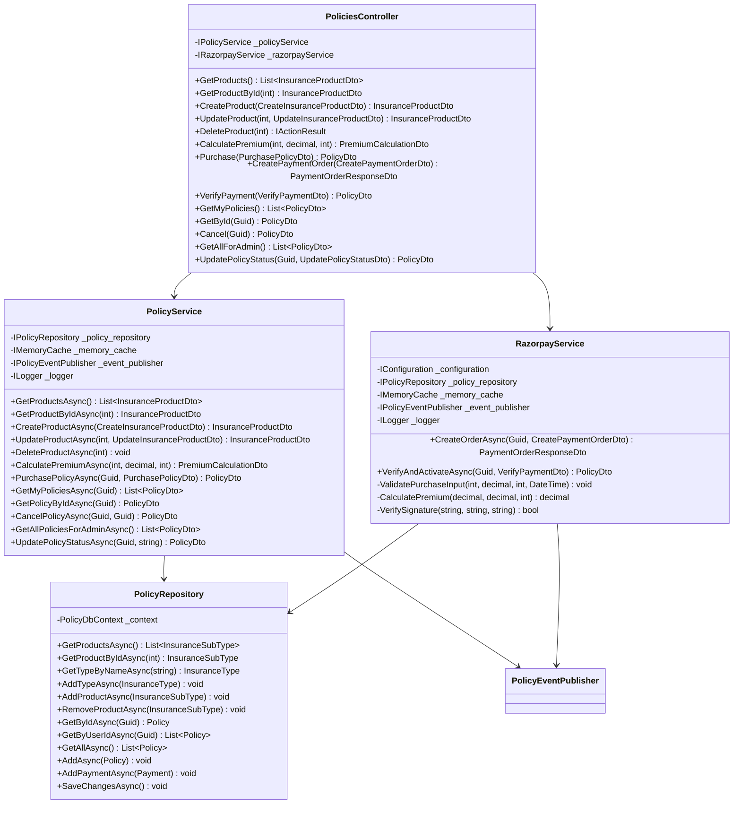
```mermaid
classDiagram
    class PoliciesController {
        -IPolicyService _policyService
        -IRazorpayService _razorpayService
        +GetProducts() List~InsuranceProductDto~
        +GetProductById(int) InsuranceProductDto
        +CreateProduct(CreateInsuranceProductDto) InsuranceProductDto
        +UpdateProduct(int, UpdateInsuranceProductDto) InsuranceProductDto
        +DeleteProduct(int) IActionResult
        +CalculatePremium(int, decimal, int) PremiumCalculationDto
        +Purchase(PurchasePolicyDto) PolicyDto
        +CreatePaymentOrder(CreatePaymentOrderDto) PaymentOrderResponseDto
        +VerifyPayment(VerifyPaymentDto) PolicyDto
        +GetMyPolicies() List~PolicyDto~
        +GetById(Guid) PolicyDto
        +Cancel(Guid) PolicyDto
        +GetAllForAdmin() List~PolicyDto~
        +UpdatePolicyStatus(Guid, UpdatePolicyStatusDto) PolicyDto
    }

    class PolicyService {
        -IPolicyRepository _policy_repository
        -IMemoryCache _memory_cache
        -IPolicyEventPublisher _event_publisher
        -ILogger _logger
        +GetProductsAsync() List~InsuranceProductDto~
        +GetProductByIdAsync(int) InsuranceProductDto
        +CreateProductAsync(CreateInsuranceProductDto) InsuranceProductDto
        +UpdateProductAsync(int, UpdateInsuranceProductDto) InsuranceProductDto
        +DeleteProductAsync(int) void
        +CalculatePremiumAsync(int, decimal, int) PremiumCalculationDto
        +PurchasePolicyAsync(Guid, PurchasePolicyDto) PolicyDto
        +GetMyPoliciesAsync(Guid) List~PolicyDto~
        +GetPolicyByIdAsync(Guid) PolicyDto
        +CancelPolicyAsync(Guid, Guid) PolicyDto
        +GetAllPoliciesForAdminAsync() List~PolicyDto~
        +UpdatePolicyStatusAsync(Guid, string) PolicyDto
    }

    class RazorpayService {
        -IConfiguration _configuration
        -IPolicyRepository _policy_repository
        -IMemoryCache _memory_cache
        -IPolicyEventPublisher _event_publisher
        -ILogger _logger
        +CreateOrderAsync(Guid, CreatePaymentOrderDto) PaymentOrderResponseDto
        +VerifyAndActivateAsync(Guid, VerifyPaymentDto) PolicyDto
        -ValidatePurchaseInput(int, decimal, int, DateTime) void
        -CalculatePremium(decimal, decimal, int) decimal
        -VerifySignature(string, string, string) bool
    }

    class PolicyRepository {
        -PolicyDbContext _context
        +GetProductsAsync() List~InsuranceSubType~
        +GetProductByIdAsync(int) InsuranceSubType
        +GetTypeByNameAsync(string) InsuranceType
        +AddTypeAsync(InsuranceType) void
        +AddProductAsync(InsuranceSubType) void
        +RemoveProductAsync(InsuranceSubType) void
        +GetByIdAsync(Guid) Policy
        +GetByUserIdAsync(Guid) List~Policy~
        +GetAllAsync() List~Policy~
        +AddAsync(Policy) void
        +AddPaymentAsync(Payment) void
        +SaveChangesAsync() void
    }

    PoliciesController --> PolicyService
    PoliciesController --> RazorpayService
    PolicyService --> PolicyRepository
    PolicyService --> PolicyEventPublisher
    RazorpayService --> PolicyRepository
    RazorpayService --> PolicyEventPublisher
```

### 2.3 ClaimsService

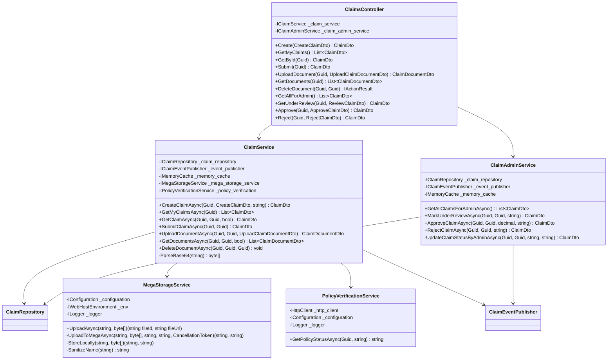
```mermaid
classDiagram
    class ClaimsController {
        -IClaimService _claim_service
        -IClaimAdminService _claim_admin_service
        +Create(CreateClaimDto) ClaimDto
        +GetMyClaims() List~ClaimDto~
        +GetById(Guid) ClaimDto
        +Submit(Guid) ClaimDto
        +UploadDocument(Guid, UploadClaimDocumentDto) ClaimDocumentDto
        +GetDocuments(Guid) List~ClaimDocumentDto~
        +DeleteDocument(Guid, Guid) IActionResult
        +GetAllForAdmin() List~ClaimDto~
        +SetUnderReview(Guid, ReviewClaimDto) ClaimDto
        +Approve(Guid, ApproveClaimDto) ClaimDto
        +Reject(Guid, RejectClaimDto) ClaimDto
    }

    class ClaimService {
        -IClaimRepository _claim_repository
        -IClaimEventPublisher _event_publisher
        -IMemoryCache _memory_cache
        -IMegaStorageService _mega_storage_service
        -IPolicyVerificationService _policy_verification
        +CreateClaimAsync(Guid, CreateClaimDto, string) ClaimDto
        +GetMyClaimsAsync(Guid) List~ClaimDto~
        +GetClaimAsync(Guid, Guid, bool) ClaimDto
        +SubmitClaimAsync(Guid, Guid) ClaimDto
        +UploadDocumentAsync(Guid, Guid, UploadClaimDocumentDto) ClaimDocumentDto
        +GetDocumentsAsync(Guid, Guid, bool) List~ClaimDocumentDto~
        +DeleteDocumentAsync(Guid, Guid, Guid) void
        -ParseBase64(string) byte[]
    }

    class ClaimAdminService {
        -IClaimRepository _claim_repository
        -IClaimEventPublisher _event_publisher
        -IMemoryCache _memory_cache
        +GetAllClaimsForAdminAsync() List~ClaimDto~
        +MarkUnderReviewAsync(Guid, Guid, string) ClaimDto
        +ApproveClaimAsync(Guid, Guid, decimal, string) ClaimDto
        +RejectClaimAsync(Guid, Guid, string) ClaimDto
        -UpdateClaimStatusByAdminAsync(Guid, Guid, string, string) ClaimDto
    }

    class MegaStorageService {
        -IConfiguration _configuration
        -IWebHostEnvironment _env
        -ILogger _logger
        +UploadAsync(string, byte[]) (string fileId, string fileUrl)
        -UploadToMegaAsync(string, byte[], string, string, CancellationToken) (string, string)
        -StoreLocally(string, byte[]) (string, string)
        -SanitizeName(string) string
    }

    class PolicyVerificationService {
        -HttpClient _http_client
        -IConfiguration _configuration
        -ILogger _logger
        +GetPolicyStatusAsync(Guid, string) string
    }

    ClaimsController --> ClaimService
    ClaimsController --> ClaimAdminService
    ClaimService --> ClaimRepository
    ClaimService --> MegaStorageService
    ClaimService --> PolicyVerificationService
    ClaimService --> ClaimEventPublisher
    ClaimAdminService --> ClaimRepository
    ClaimAdminService --> ClaimEventPublisher
```

### 2.4 AdminService

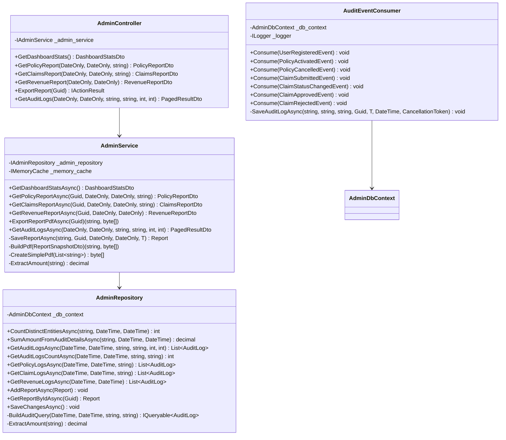
```mermaid
classDiagram
    class AdminController {
        -IAdminService _admin_service
        +GetDashboardStats() DashboardStatsDto
        +GetPolicyReport(DateOnly, DateOnly, string) PolicyReportDto
        +GetClaimsReport(DateOnly, DateOnly, string) ClaimsReportDto
        +GetRevenueReport(DateOnly, DateOnly) RevenueReportDto
        +ExportReport(Guid) IActionResult
        +GetAuditLogs(DateOnly, DateOnly, string, string, int, int) PagedResultDto
    }

    class AdminService {
        -IAdminRepository _admin_repository
        -IMemoryCache _memory_cache
        +GetDashboardStatsAsync() DashboardStatsDto
        +GetPolicyReportAsync(Guid, DateOnly, DateOnly, string) PolicyReportDto
        +GetClaimsReportAsync(Guid, DateOnly, DateOnly, string) ClaimsReportDto
        +GetRevenueReportAsync(Guid, DateOnly, DateOnly) RevenueReportDto
        +ExportReportPdfAsync(Guid) (string, byte[])
        +GetAuditLogsAsync(DateOnly, DateOnly, string, string, int, int) PagedResultDto
        -SaveReportAsync(string, Guid, DateOnly, DateOnly, T) Report
        -BuildPdf(ReportSnapshotDto) (string, byte[])
        -CreateSimplePdf(List~string~) byte[]
        -ExtractAmount(string) decimal
    }

    class AdminRepository {
        -AdminDbContext _db_context
        +CountDistinctEntitiesAsync(string, DateTime, DateTime) int
        +SumAmountFromAuditDetailsAsync(string, DateTime, DateTime) decimal
        +GetAuditLogsAsync(DateTime, DateTime, string, string, int, int) List~AuditLog~
        +GetAuditLogsCountAsync(DateTime, DateTime, string, string) int
        +GetPolicyLogsAsync(DateTime, DateTime, string) List~AuditLog~
        +GetClaimLogsAsync(DateTime, DateTime, string) List~AuditLog~
        +GetRevenueLogsAsync(DateTime, DateTime) List~AuditLog~
        +AddReportAsync(Report) void
        +GetReportByIdAsync(Guid) Report
        +SaveChangesAsync() void
        -BuildAuditQuery(DateTime, DateTime, string, string) IQueryable~AuditLog~
        -ExtractAmount(string) decimal
    }

    class AuditEventConsumer {
        -AdminDbContext _db_context
        -ILogger _logger
        +Consume(UserRegisteredEvent) void
        +Consume(PolicyActivatedEvent) void
        +Consume(PolicyCancelledEvent) void
        +Consume(ClaimSubmittedEvent) void
        +Consume(ClaimStatusChangedEvent) void
        +Consume(ClaimApprovedEvent) void
        +Consume(ClaimRejectedEvent) void
        -SaveAuditLogAsync(string, string, string, Guid, T, DateTime, CancellationToken) void
    }

    AdminController --> AdminService
    AdminService --> AdminRepository
    AuditEventConsumer --> AdminDbContext
```

---
## 3. Sequence Diagrams

### 3.1 OTP-Based User Registration

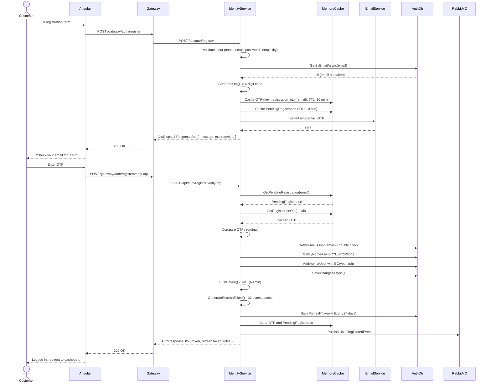
```mermaid
sequenceDiagram
    actor Customer
    participant Angular
    participant Gateway
    participant IdentityService
    participant MemoryCache
    participant EmailService
    participant AuthDb

    Customer->>Angular: Fill registration form
    Angular->>Gateway: POST /gateway/auth/register
    Gateway->>IdentityService: POST /api/auth/register
    IdentityService->>IdentityService: Validate input (name, email, password complexity)
    IdentityService->>AuthDb: GetByEmailAsync(email)
    AuthDb-->>IdentityService: null (email not taken)
    IdentityService->>IdentityService: GenerateOtp() -> 6-digit code
    IdentityService->>MemoryCache: Cache OTP (key: registration_otp_{email}, TTL: 10 min)
    IdentityService->>MemoryCache: Cache PendingRegistration (TTL: 10 min)
    IdentityService->>EmailService: SendAsync(email, OTP)
    EmailService-->>IdentityService: sent
    IdentityService-->>Gateway: OtpDispatchResponseDto { message, expiresAtUtc }
    Gateway-->>Angular: 200 OK
    Angular-->>Customer: "Check your email for OTP"

    Customer->>Angular: Enter OTP
    Angular->>Gateway: POST /gateway/auth/register/verify-otp
    Gateway->>IdentityService: POST /api/auth/register/verify-otp
    IdentityService->>MemoryCache: GetPendingRegistration(email)
    MemoryCache-->>IdentityService: PendingRegistration
    IdentityService->>MemoryCache: GetRegistrationOtp(email)
    MemoryCache-->>IdentityService: cached OTP
    IdentityService->>IdentityService: Compare OTPs (ordinal)
    IdentityService->>AuthDb: GetByEmailAsync(email) - double check
    IdentityService->>AuthDb: GetByNameAsync("CUSTOMER")
    IdentityService->>AuthDb: AddAsync(User with BCrypt hash)
    IdentityService->>AuthDb: SaveChangesAsync()
    IdentityService->>IdentityService: BuildToken() - JWT (60 min)
    IdentityService->>IdentityService: GenerateRefreshToken() - 32 bytes base64
    IdentityService->>AuthDb: Save RefreshToken + Expiry (7 days)
    IdentityService->>MemoryCache: Clear OTP and PendingRegistration
    IdentityService->>RabbitMQ: Publish UserRegisteredEvent
    IdentityService-->>Gateway: AuthResponseDto { token, refreshToken, roles }
    Gateway-->>Angular: 200 OK
    Angular-->>Customer: Logged in, redirect to dashboard
```

### 3.2 Email/Password Login

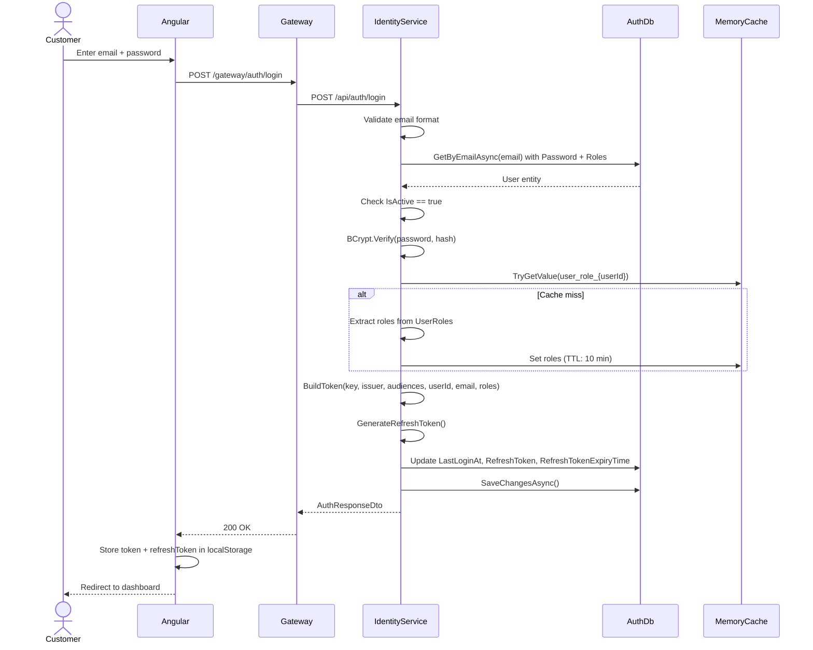
```mermaid
sequenceDiagram
    actor Customer
    participant Angular
    participant Gateway
    participant IdentityService
    participant AuthDb
    participant MemoryCache

    Customer->>Angular: Enter email + password
    Angular->>Gateway: POST /gateway/auth/login
    Gateway->>IdentityService: POST /api/auth/login
    IdentityService->>IdentityService: Validate email format
    IdentityService->>AuthDb: GetByEmailAsync(email) with Password + Roles
    AuthDb-->>IdentityService: User entity
    IdentityService->>IdentityService: Check IsActive == true
    IdentityService->>IdentityService: BCrypt.Verify(password, hash)
    IdentityService->>MemoryCache: TryGetValue(user_role_{userId})
    alt Cache miss
        IdentityService->>IdentityService: Extract roles from UserRoles
        IdentityService->>MemoryCache: Set roles (TTL: 10 min)
    end
    IdentityService->>IdentityService: BuildToken(key, issuer, audiences, userId, email, roles)
    IdentityService->>IdentityService: GenerateRefreshToken()
    IdentityService->>AuthDb: Update LastLoginAt, RefreshToken, RefreshTokenExpiryTime
    IdentityService->>AuthDb: SaveChangesAsync()
    IdentityService-->>Gateway: AuthResponseDto
    Gateway-->>Angular: 200 OK
    Angular->>Angular: Store token + refreshToken in localStorage
    Angular-->>Customer: Redirect to dashboard
```

### 3.3 JWT Refresh Token Rotation

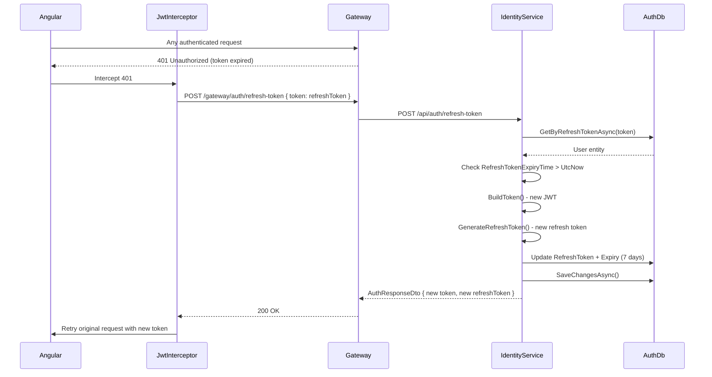
```mermaid
sequenceDiagram
    participant Angular
    participant JwtInterceptor
    participant Gateway
    participant IdentityService
    participant AuthDb

    Angular->>Gateway: Any authenticated request
    Gateway-->>Angular: 401 Unauthorized (token expired)
    Angular->>JwtInterceptor: Intercept 401
    JwtInterceptor->>Gateway: POST /gateway/auth/refresh-token { token: refreshToken }
    Gateway->>IdentityService: POST /api/auth/refresh-token
    IdentityService->>AuthDb: GetByRefreshTokenAsync(token)
    AuthDb-->>IdentityService: User entity
    IdentityService->>IdentityService: Check RefreshTokenExpiryTime > UtcNow
    IdentityService->>IdentityService: BuildToken() - new JWT
    IdentityService->>IdentityService: GenerateRefreshToken() - new refresh token
    IdentityService->>AuthDb: Update RefreshToken + Expiry (7 days)
    IdentityService->>AuthDb: SaveChangesAsync()
    IdentityService-->>Gateway: AuthResponseDto { new token, new refreshToken }
    Gateway-->>JwtInterceptor: 200 OK
    JwtInterceptor->>Angular: Retry original request with new token
```

### 3.4 Razorpay Policy Purchase

```mermaid
sequenceDiagram
    actor Customer
    participant Angular
    participant Gateway
    participant PolicyService
    participant RazorpayAPI
    participant MemoryCache
    participant PolicyDb
    participant RabbitMQ

    Customer->>Angular: Select product, coverage, term, date
    Angular->>Gateway: POST /gateway/policies/payment/create-order
    Gateway->>PolicyService: POST /api/policies/payment/create-order
    PolicyService->>PolicyService: ValidatePurchaseInput()
    PolicyService->>PolicyDb: GetProductByIdAsync(productId)
    PolicyDb-->>PolicyService: InsuranceSubType
    PolicyService->>PolicyService: CalculatePremium(basePremium, coverage, term)
    PolicyService->>RazorpayAPI: Order.Create({ amount_paise, currency: INR })
    RazorpayAPI-->>PolicyService: { id: order_XXXX }
    PolicyService->>MemoryCache: Cache PendingPurchase (key: razorpay_pending_{token}, TTL: 30 min)
    PolicyService-->>Gateway: PaymentOrderResponseDto { orderId, amountPaise, keyId, token }
    Gateway-->>Angular: 200 OK

    Angular->>Angular: Open Razorpay checkout widget
    Customer->>Angular: Complete payment in browser
    Angular->>Angular: Receive { razorpay_order_id, razorpay_payment_id, razorpay_signature }

    Angular->>Gateway: POST /gateway/policies/payment/verify
    Gateway->>PolicyService: POST /api/policies/payment/verify
    PolicyService->>MemoryCache: Get PendingPurchase by token
    MemoryCache-->>PolicyService: PendingPurchase
    PolicyService->>PolicyService: Verify orderId matches
    PolicyService->>PolicyService: HMAC-SHA256 verify signature
    PolicyService->>MemoryCache: Remove PendingPurchase (replay prevention)
    PolicyService->>PolicyDb: AddAsync(Policy { status: ACTIVE })
    PolicyService->>PolicyDb: AddPaymentAsync(Payment { method: RAZORPAY })
    PolicyService->>PolicyDb: SaveChangesAsync()
    PolicyService->>MemoryCache: Remove user_policies_{userId}
    PolicyService->>RabbitMQ: Publish PolicyActivatedEvent (non-fatal)
    PolicyService-->>Gateway: PolicyDto
    Gateway-->>Angular: 200 OK
    Angular-->>Customer: Policy activated confirmation
```

---
## 4. State Machine Diagrams

### 4.1 Claim Lifecycle State Machine

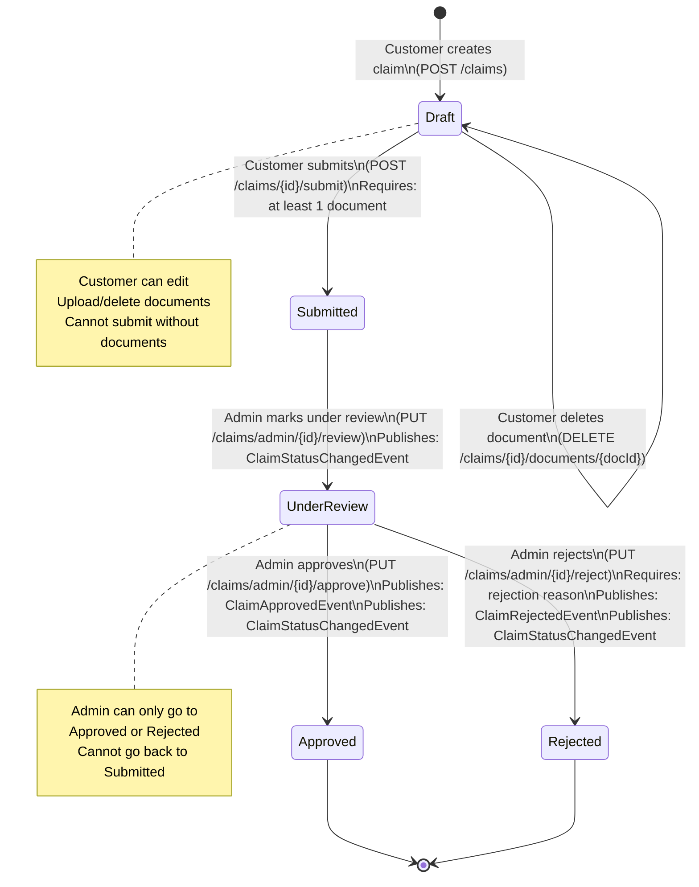
```mermaid
stateDiagram-v2
    [*] --> Draft : Customer creates claim\n(POST /claims)

    Draft --> Submitted : Customer submits\n(POST /claims/{id}/submit)\nRequires: at least 1 document

    Draft --> Draft : Customer uploads document\n(POST /claims/{id}/documents)

    Draft --> Draft : Customer deletes document\n(DELETE /claims/{id}/documents/{docId})

    Submitted --> UnderReview : Admin marks under review\n(PUT /claims/admin/{id}/review)\nPublishes: ClaimStatusChangedEvent

    UnderReview --> Approved : Admin approves\n(PUT /claims/admin/{id}/approve)\nPublishes: ClaimApprovedEvent\nPublishes: ClaimStatusChangedEvent

    UnderReview --> Rejected : Admin rejects\n(PUT /claims/admin/{id}/reject)\nRequires: rejection reason\nPublishes: ClaimRejectedEvent\nPublishes: ClaimStatusChangedEvent

    Approved --> [*]
    Rejected --> [*]

    note right of Draft
        Customer can edit
        Upload/delete documents
        Cannot submit without documents
    end note

    note right of UnderReview
        Admin can only go to
        Approved or Rejected
        Cannot go back to Submitted
    end note
```

### 4.2 Policy Lifecycle State Machine

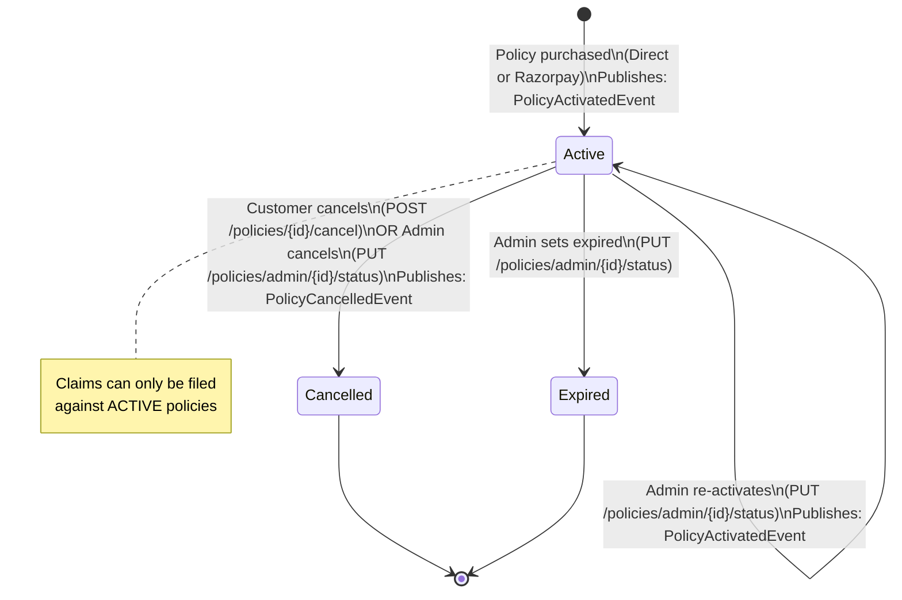
```mermaid
stateDiagram-v2
    [*] --> Active : Policy purchased\n(Direct or Razorpay)\nPublishes: PolicyActivatedEvent

    Active --> Cancelled : Customer cancels\n(POST /policies/{id}/cancel)\nOR Admin cancels\n(PUT /policies/admin/{id}/status)\nPublishes: PolicyCancelledEvent

    Active --> Expired : Admin sets expired\n(PUT /policies/admin/{id}/status)

    Active --> Active : Admin re-activates\n(PUT /policies/admin/{id}/status)\nPublishes: PolicyActivatedEvent

    Cancelled --> [*]
    Expired --> [*]

    note right of Active
        Claims can only be filed
        against ACTIVE policies
    end note
```

---
## 5. Component & Layer Architecture

...existing content...

---
## 6. API Contract Details

...existing content...

---
## 7. Database Schema Details

...existing content...

---
## 8. Caching Design

...existing content...

---
## 9. Error Handling Design

...existing content...

---
## 10. Security Design Details

...existing content...

---
## 11. RabbitMQ Event Contracts

...existing content...
