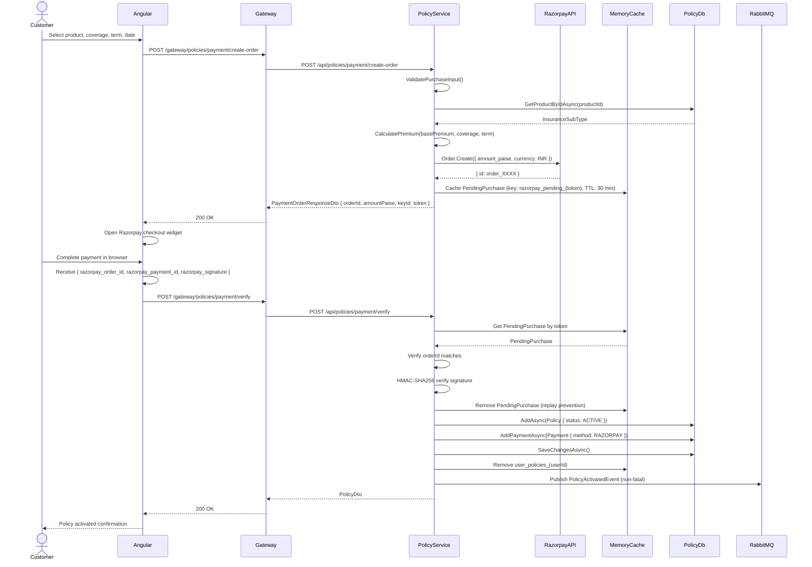
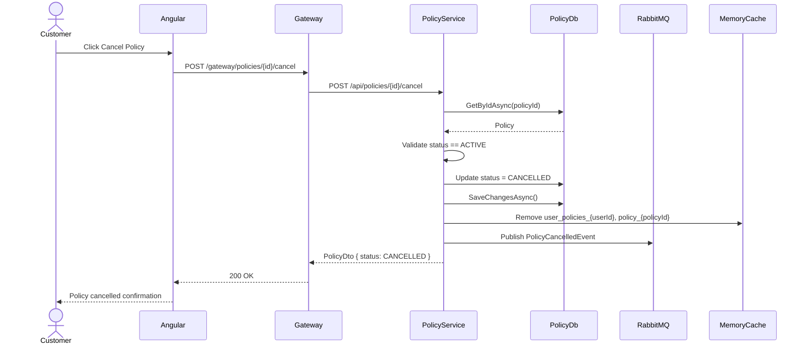

# SmartSure Platform  Low-Level Design (LLD)

**Version:** 2.0
**Stack:** .NET 10  Angular 17  SQL Server  RabbitMQ  Ocelot

---

## Table of Contents

1. Entity Relationship Diagrams
2. Class Diagrams  All Services
3. Sequence Diagrams  All Key Flows
4. State Machine Diagrams
5. Component & Layer Diagrams
6. API Contract Details
7. Database Schema Details
8. Caching & Memory Design
9. Error Handling Design
10. Security Design Details

---
## 1. Entity Relationship Diagrams

### 1.1 IdentityService  AuthDb

`mermaid
erDiagram
    User {
        Guid UserId PK
        string FullName
        string Email UK
        string PhoneNumber
        string Address
        bool IsActive
        string GoogleSubject
        DateTime CreatedAt
        DateTime LastLoginAt
        string RefreshToken
        DateTime RefreshTokenExpiryTime
    }
    Password {
        Guid PassId PK
        Guid UserId FK
        string PasswordHash
    }
    Role {
        Guid RoleId PK
        string RoleName UK
    }
    UserRole {
        Guid Id PK
        Guid UserId FK
        Guid RoleId FK
    }
    PasswordResetToken {
        Guid Id PK
        Guid UserId FK
        string Token
        DateTime ExpiresAt
        bool IsUsed
    }

    User ||--o{ UserRole : "has"
    Role ||--o{ UserRole : "assigned to"
    User ||--o| Password : "has"
    User ||--o{ PasswordResetToken : "has"
`

### 1.2 PolicyService  PolicyDb

`mermaid
erDiagram
    InsuranceType {
        int TypeId PK
        string TypeName UK
    }
    InsuranceSubType {
        int SubTypeId PK
        int TypeId FK
        string SubTypeName
        decimal BasePremium
    }
    Policy {
        guid PolicyId PK
        string PolicyNumber UK
        guid UserId
        int TypeId FK
        int SubTypeId FK
        string Status
        datetime IssuedDate
        date InsuranceDate
        date EndDate
        decimal CoverageAmount

#### Class Diagram: PolicyService


#### Sequence Diagram: Policy Purchase (Razorpay)



#### Sequence Diagram: Policy Cancellation



#### Use Case Diagram: PolicyService

```mermaid
usecaseDiagram
    actor Customer
    actor Admin
    Customer -- (Purchase Policy)
    Customer -- (View My Policies)
    Customer -- (Cancel Policy)
    Customer -- (View Policy Details)
    Admin -- (Create Product)
    Admin -- (Update Product)
    Admin -- (Delete Product)
    Admin -- (View All Policies)
    Admin -- (Update Policy Status)
```
        decimal MonthlyPremium
        datetime CreatedAt
        datetime UpdatedAt
    }
    PolicyDetail {
        guid PolicyDetailId PK
        guid PolicyId FK
        string Details
    }
    VehicleDetail {
        guid VehicleId PK
        guid PolicyId FK
        string VehicleNumber
        string Model
        int YearOfMake
        int EngineCC
    }
    HomeDetail {
        guid HomeId PK
        guid PolicyId FK
        string Address
        int YearBuilt
        string ConstructionType
    }
    Premium {
        guid PremiumId PK
        guid PolicyId FK
        decimal Amount
        date DueDate
        datetime PaidAt
        string Status
    }
    Payment {
        guid PaymentId PK
        guid PolicyId FK
        decimal Amount
        datetime PaymentDate
        string PaymentMethod
        string TransactionRef
        string Status
    }

    InsuranceType ||--o{ InsuranceSubType : "contains"
    InsuranceType ||--o{ Policy : "categorises"
    InsuranceSubType ||--o{ Policy : "product for"
    Policy ||--o| PolicyDetail : "has"
    Policy ||--o| VehicleDetail : "has"
    Policy ||--o| HomeDetail : "has"
    Policy ||--o{ Premium : "generates"
    Policy ||--o{ Payment : "paid via"
`

### 1.3 ClaimsService  ClaimsDb

`mermaid
erDiagram
    Claim {
        Guid ClaimId PK
        string ClaimNumber UK
        Guid PolicyId
        Guid UserId
        string Description
        decimal ClaimAmount
        string Status
        string AdminNote
        Guid ReviewedBy
        DateTime CreatedDate
        DateTime SubmittedAt
        DateTime ReviewedAt
        DateTime UpdatedAt
    }
    ClaimDocument {
        Guid DocId PK
        Guid ClaimId FK
        string FileName
        string MegaNzFileId
        string FileUrl
        string FileType
        int FileSizeKb
        DateTime UploadedAt
    }
    ClaimStatusHistory {
        Guid HistoryId PK
        Guid ClaimId FK
        string OldStatus
        string NewStatus
        Guid ChangedBy
        DateTime ChangedDate
        string Note
    }

    Claim ||--o{ ClaimDocument : "has"
    Claim ||--o{ ClaimStatusHistory : "tracks"
`

### 1.4 AdminService  AdminDb

`mermaid
erDiagram
    AuditLog {
        Guid LogId PK
        Guid UserId
        string Action
        string EntityType
        string EntityId
        string Details
        DateTime TimeStamp
    }
    Report {
        Guid ReportId PK
        string ReportType
        DateTime GeneratedDate
        Guid UserId
        DateOnly PeriodFrom
        DateOnly PeriodTo
        string DataJson
    }
`

---
## 2. Class Diagrams

### 2.1 IdentityService

`mermaid
classDiagram
    class AuthController {
        -IAuthService _authService
        -IGoogleAuthService _googleAuthService
        -IConfiguration _configuration
        +Register(RegisterDto) OtpDispatchResponseDto
        +VerifyRegistrationOtp(VerifyRegistrationOtpDto) AuthResponseDto
        +ResendRegistrationOtp(ResendRegistrationOtpDto) OtpDispatchResponseDto
        +Login(LoginDto) AuthResponseDto
        +GoogleLoginUrl() string
        +GoogleCallback() IActionResult
        +RefreshToken(RefreshTokenDto) AuthResponseDto
        +ForgotPassword(ForgotPasswordDto) IActionResult
        +ResetPassword(ResetPasswordDto) IActionResult
    }

    class UsersController {
        -IProfileService _profileService
        -IUserAdministrationService _userAdministrationService
        +GetProfile() ProfileDto
        +UpdateProfile(UpdateProfileDto) ProfileDto
        +GetUsers() List~ProfileDto~
        +UpdateUserStatus(Guid, bool) IActionResult
        +UpdateUserRole(Guid, string) IActionResult
    }

    class AuthService {
        -IConfiguration _configuration
        -IMemoryCache _memoryCache
        -IUserRepository _userRepository
        -IRoleRepository _roleRepository
        -IJwtService _jwtService
        -IEmailService _emailService
        -IUserRegisteredEventPublisher _eventPublisher
        +RegisterAsync(RegisterDto) OtpDispatchResponseDto
        +VerifyRegistrationOtpAsync(VerifyRegistrationOtpDto) AuthResponseDto
        +ResendRegistrationOtpAsync(ResendRegistrationOtpDto) OtpDispatchResponseDto
        +LoginAsync(LoginDto) AuthResponseDto
        +RefreshTokenAsync(RefreshTokenDto) AuthResponseDto
        +RequestPasswordResetAsync(ForgotPasswordDto) void
        +ResetPasswordAsync(ResetPasswordDto) void
        -GenerateOtp() string
        -GetRoleNames(User) string[]
        -GetJwtAudiences() string[]
        -NormalizeEmail(string) string
    }

    class JwtService {
        -IConfiguration _configuration
        +BuildToken(string, string, IEnumerable~string~, string, string, IEnumerable~string~) string
        +GenerateRefreshToken() string
    }

    class UserRepository {
        -IdentityDbContext _context
        +GetByEmailAsync(string) User
        +GetByIdAsync(Guid) User
        +GetByRefreshTokenAsync(string) User
        +GetAllAsync() List~User~
        +AddAsync(User) void
        +SaveChangesAsync() void
    }

    AuthController --> AuthService
    AuthController --> GoogleAuthService
    UsersController --> ProfileService
    UsersController --> UserAdministrationService
    AuthService --> UserRepository
    AuthService --> RoleRepository
    AuthService --> JwtService
    AuthService --> EmailService
`

### 2.2 PolicyService

`mermaid
classDiagram
    class PoliciesController {
        -IPolicyService _policyService
        -IRazorpayService _razorpayService
        +GetProducts() List~InsuranceProductDto~
        +GetProductById(int) InsuranceProductDto
        +CreateProduct(CreateInsuranceProductDto) InsuranceProductDto
        +UpdateProduct(int, UpdateInsuranceProductDto) InsuranceProductDto
        +DeleteProduct(int) IActionResult
        +CalculatePremium(int, decimal, int) PremiumCalculationDto
        +Purchase(PurchasePolicyDto) PolicyDto
        +CreatePaymentOrder(CreatePaymentOrderDto) PaymentOrderResponseDto
        +VerifyPayment(VerifyPaymentDto) PolicyDto
        +GetMyPolicies() List~PolicyDto~
        +GetById(Guid) PolicyDto
        +Cancel(Guid) PolicyDto
        +GetAllForAdmin() List~PolicyDto~
        +UpdatePolicyStatus(Guid, UpdatePolicyStatusDto) PolicyDto
    }

    class PolicyService {
        -IPolicyRepository _policyRepository
        -IMemoryCache _memoryCache
        -IPolicyEventPublisher _eventPublisher
        -ILogger _logger
        +GetProductsAsync() List~InsuranceProductDto~
        +GetProductByIdAsync(int) InsuranceProductDto
        +CreateProductAsync(CreateInsuranceProductDto) InsuranceProductDto
        +UpdateProductAsync(int, UpdateInsuranceProductDto) InsuranceProductDto
        +DeleteProductAsync(int) void
        +CalculatePremiumAsync(int, decimal, int) PremiumCalculationDto
        +PurchasePolicyAsync(Guid, PurchasePolicyDto) PolicyDto
        +GetMyPoliciesAsync(Guid) List~PolicyDto~
        +GetPolicyByIdAsync(Guid) PolicyDto
        +CancelPolicyAsync(Guid, Guid) PolicyDto
        +GetAllPoliciesForAdminAsync() List~PolicyDto~
        +UpdatePolicyStatusAsync(Guid, string) PolicyDto
    }

    class RazorpayService {
        -IConfiguration _configuration
        -IPolicyRepository _policyRepository
        -IMemoryCache _memoryCache
        -IPolicyEventPublisher _eventPublisher
        -ILogger _logger
        +CreateOrderAsync(Guid, CreatePaymentOrderDto) PaymentOrderResponseDto
        +VerifyAndActivateAsync(Guid, VerifyPaymentDto) PolicyDto
        -ValidatePurchaseInput(int, decimal, int, DateTime) void
        -CalculatePremium(decimal, decimal, int) decimal
        -VerifySignature(string, string, string) bool
    }

    class PolicyRepository {
        -PolicyDbContext _context
        +GetProductsAsync() List~InsuranceSubType~
        +GetProductByIdAsync(int) InsuranceSubType
        +GetTypeByNameAsync(string) InsuranceType
        +AddTypeAsync(InsuranceType) void
        +AddProductAsync(InsuranceSubType) void
        +RemoveProductAsync(InsuranceSubType) void
        +GetByIdAsync(Guid) Policy
        +GetByUserIdAsync(Guid) List~Policy~
        +GetAllAsync() List~Policy~
        +AddAsync(Policy) void
        +AddPaymentAsync(Payment) void
        +SaveChangesAsync() void
    }

    PoliciesController --> PolicyService
    PoliciesController --> RazorpayService
    PolicyService --> PolicyRepository
    PolicyService --> PolicyEventPublisher
    RazorpayService --> PolicyRepository
    RazorpayService --> PolicyEventPublisher
`

### 2.3 ClaimsService

`mermaid
classDiagram
    class ClaimsController {
        -IClaimService _claimService
        -IClaimAdminService _claimAdminService
        +Create(CreateClaimDto) ClaimDto
        +GetMyClaims() List~ClaimDto~
        +GetById(Guid) ClaimDto
        +Submit(Guid) ClaimDto
        +UploadDocument(Guid, UploadClaimDocumentDto) ClaimDocumentDto
        +GetDocuments(Guid) List~ClaimDocumentDto~
        +DeleteDocument(Guid, Guid) IActionResult
        +GetAllForAdmin() List~ClaimDto~
        +SetUnderReview(Guid, ReviewClaimDto) ClaimDto
        +Approve(Guid, ApproveClaimDto) ClaimDto
        +Reject(Guid, RejectClaimDto) ClaimDto
    }

    class ClaimService {
        -IClaimRepository _claimRepository
        -IClaimEventPublisher _eventPublisher
        -IMemoryCache _memoryCache
        -IMegaStorageService _megaStorageService
        -IPolicyVerificationService _policyVerification
        +CreateClaimAsync(Guid, CreateClaimDto, string) ClaimDto
        +GetMyClaimsAsync(Guid) List~ClaimDto~
        +GetClaimAsync(Guid, Guid, bool) ClaimDto
        +SubmitClaimAsync(Guid, Guid) ClaimDto
        +UploadDocumentAsync(Guid, Guid, UploadClaimDocumentDto) ClaimDocumentDto
        +GetDocumentsAsync(Guid, Guid, bool) List~ClaimDocumentDto~
        +DeleteDocumentAsync(Guid, Guid, Guid) void
        -ParseBase64(string) byte[]
    }

    class ClaimAdminService {
        -IClaimRepository _claimRepository
        -IClaimEventPublisher _eventPublisher
        -IMemoryCache _memoryCache
        +GetAllClaimsForAdminAsync() List~ClaimDto~
        +MarkUnderReviewAsync(Guid, Guid, string) ClaimDto
        +ApproveClaimAsync(Guid, Guid, decimal, string) ClaimDto
        +RejectClaimAsync(Guid, Guid, string) ClaimDto
        -UpdateClaimStatusByAdminAsync(Guid, Guid, string, string) ClaimDto
    }

    class MegaStorageService {
        -IConfiguration _configuration
        -IWebHostEnvironment _env
        -ILogger _logger
        +UploadAsync(string, byte[]) (string fileId, string fileUrl)
        -UploadToMegaAsync(string, byte[], string, string, CancellationToken) (string, string)
        -StoreLocally(string, byte[]) (string, string)
        -SanitizeName(string) string
    }

    class PolicyVerificationService {
        -HttpClient _httpClient
        -IConfiguration _configuration
        -ILogger _logger
        +GetPolicyStatusAsync(Guid, string) string
    }

    ClaimsController --> ClaimService
    ClaimsController --> ClaimAdminService
    ClaimService --> ClaimRepository
    ClaimService --> MegaStorageService
    ClaimService --> PolicyVerificationService
    ClaimService --> ClaimEventPublisher
    ClaimAdminService --> ClaimRepository
    ClaimAdminService --> ClaimEventPublisher
`

### 2.4 AdminService

`mermaid
classDiagram
    class AdminController {
        -IAdminService _adminService
        +GetDashboardStats() DashboardStatsDto
        +GetPolicyReport(DateOnly, DateOnly, string) PolicyReportDto
        +GetClaimsReport(DateOnly, DateOnly, string) ClaimsReportDto
        +GetRevenueReport(DateOnly, DateOnly) RevenueReportDto
        +ExportReport(Guid) IActionResult
        +GetAuditLogs(DateOnly, DateOnly, string, string, int, int) PagedResultDto
    }

    class AdminService {
        -IAdminRepository _adminRepository
        -IMemoryCache _memoryCache
        +GetDashboardStatsAsync() DashboardStatsDto
        +GetPolicyReportAsync(Guid, DateOnly, DateOnly, string) PolicyReportDto
        +GetClaimsReportAsync(Guid, DateOnly, DateOnly, string) ClaimsReportDto
        +GetRevenueReportAsync(Guid, DateOnly, DateOnly) RevenueReportDto
        +ExportReportPdfAsync(Guid) (string, byte[])
        +GetAuditLogsAsync(DateOnly, DateOnly, string, string, int, int) PagedResultDto
        -SaveReportAsync(string, Guid, DateOnly, DateOnly, T) Report
        -BuildPdf(ReportSnapshotDto) (string, byte[])
        -CreateSimplePdf(List~string~) byte[]
        -ExtractAmount(string) decimal
    }

    class AdminRepository {
        -AdminDbContext _dbContext
        +CountDistinctEntitiesAsync(string, DateTime, DateTime) int
        +SumAmountFromAuditDetailsAsync(string, DateTime, DateTime) decimal
        +GetAuditLogsAsync(DateTime, DateTime, string, string, int, int) List~AuditLog~
        +GetAuditLogsCountAsync(DateTime, DateTime, string, string) int
        +GetPolicyLogsAsync(DateTime, DateTime, string) List~AuditLog~
        +GetClaimLogsAsync(DateTime, DateTime, string) List~AuditLog~
        +GetRevenueLogsAsync(DateTime, DateTime) List~AuditLog~
        +AddReportAsync(Report) void
        +GetReportByIdAsync(Guid) Report
        +SaveChangesAsync() void
        -BuildAuditQuery(DateTime, DateTime, string, string) IQueryable~AuditLog~
        -ExtractAmount(string) decimal
    }

    class AuditEventConsumer {
        -AdminDbContext _dbContext
        -ILogger _logger
        +Consume(UserRegisteredEvent) void
        +Consume(PolicyActivatedEvent) void
        +Consume(PolicyCancelledEvent) void
        +Consume(ClaimSubmittedEvent) void
        +Consume(ClaimStatusChangedEvent) void
        +Consume(ClaimApprovedEvent) void
        +Consume(ClaimRejectedEvent) void
        -SaveAuditLogAsync(string, string, string, Guid, T, DateTime, CancellationToken) void
    }

    AdminController --> AdminService
    AdminService --> AdminRepository
    AuditEventConsumer --> AdminDbContext
`

---
## 3. Sequence Diagrams

### 3.1 OTP-Based User Registration

`mermaid
sequenceDiagram
    actor Customer
    participant Angular
    participant Gateway
    participant IdentityService
    participant MemoryCache
    participant EmailService
    participant AuthDb

    Customer->>Angular: Fill registration form
    Angular->>Gateway: POST /gateway/auth/register
    Gateway->>IdentityService: POST /api/auth/register
    IdentityService->>IdentityService: Validate input (name, email, password complexity)
    IdentityService->>AuthDb: GetByEmailAsync(email)
    AuthDb-->>IdentityService: null (email not taken)
    IdentityService->>IdentityService: GenerateOtp() -> 6-digit code
    IdentityService->>MemoryCache: Cache OTP (key: registration_otp_{email}, TTL: 10 min)
    IdentityService->>MemoryCache: Cache PendingRegistration (TTL: 10 min)
    IdentityService->>EmailService: SendAsync(email, OTP)
    EmailService-->>IdentityService: sent
    IdentityService-->>Gateway: OtpDispatchResponseDto { message, expiresAtUtc }
    Gateway-->>Angular: 200 OK
    Angular-->>Customer: "Check your email for OTP"

    Customer->>Angular: Enter OTP
    Angular->>Gateway: POST /gateway/auth/register/verify-otp
    Gateway->>IdentityService: POST /api/auth/register/verify-otp
    IdentityService->>MemoryCache: GetPendingRegistration(email)
    MemoryCache-->>IdentityService: PendingRegistration
    IdentityService->>MemoryCache: GetRegistrationOtp(email)
    MemoryCache-->>IdentityService: cached OTP
    IdentityService->>IdentityService: Compare OTPs (ordinal)
    IdentityService->>AuthDb: GetByEmailAsync(email) - double check
    IdentityService->>AuthDb: GetByNameAsync("CUSTOMER")
    IdentityService->>AuthDb: AddAsync(User with BCrypt hash)
    IdentityService->>AuthDb: SaveChangesAsync()
    IdentityService->>IdentityService: BuildToken() - JWT (60 min)
    IdentityService->>IdentityService: GenerateRefreshToken() - 32 bytes base64
    IdentityService->>AuthDb: Save RefreshToken + Expiry (7 days)
    IdentityService->>MemoryCache: Clear OTP and PendingRegistration
    IdentityService->>RabbitMQ: Publish UserRegisteredEvent
    IdentityService-->>Gateway: AuthResponseDto { token, refreshToken, roles }
    Gateway-->>Angular: 200 OK
    Angular-->>Customer: Logged in, redirect to dashboard
`

### 3.2 Email/Password Login

`mermaid
sequenceDiagram
    actor Customer
    participant Angular
    participant Gateway
    participant IdentityService
    participant AuthDb
    participant MemoryCache

    Customer->>Angular: Enter email + password
    Angular->>Gateway: POST /gateway/auth/login
    Gateway->>IdentityService: POST /api/auth/login
    IdentityService->>IdentityService: Validate email format
    IdentityService->>AuthDb: GetByEmailAsync(email) with Password + Roles
    AuthDb-->>IdentityService: User entity
    IdentityService->>IdentityService: Check IsActive == true
    IdentityService->>IdentityService: BCrypt.Verify(password, hash)
    IdentityService->>MemoryCache: TryGetValue(user_role_{userId})
    alt Cache miss
        IdentityService->>IdentityService: Extract roles from UserRoles
        IdentityService->>MemoryCache: Set roles (TTL: 10 min)
    end
    IdentityService->>IdentityService: BuildToken(key, issuer, audiences, userId, email, roles)
    IdentityService->>IdentityService: GenerateRefreshToken()
    IdentityService->>AuthDb: Update LastLoginAt, RefreshToken, RefreshTokenExpiryTime
    IdentityService->>AuthDb: SaveChangesAsync()
    IdentityService-->>Gateway: AuthResponseDto
    Gateway-->>Angular: 200 OK
    Angular->>Angular: Store token + refreshToken in localStorage
    Angular-->>Customer: Redirect to dashboard
`

### 3.3 JWT Refresh Token Rotation

`mermaid
sequenceDiagram
    participant Angular
    participant JwtInterceptor
    participant Gateway
    participant IdentityService
    participant AuthDb

    Angular->>Gateway: Any authenticated request
    Gateway-->>Angular: 401 Unauthorized (token expired)
    Angular->>JwtInterceptor: Intercept 401
    JwtInterceptor->>Gateway: POST /gateway/auth/refresh-token { token: refreshToken }
    Gateway->>IdentityService: POST /api/auth/refresh-token
    IdentityService->>AuthDb: GetByRefreshTokenAsync(token)
    AuthDb-->>IdentityService: User entity
    IdentityService->>IdentityService: Check RefreshTokenExpiryTime > UtcNow
    IdentityService->>IdentityService: BuildToken() - new JWT
    IdentityService->>IdentityService: GenerateRefreshToken() - new refresh token
    IdentityService->>AuthDb: Update RefreshToken + Expiry (7 days)
    IdentityService->>AuthDb: SaveChangesAsync()
    IdentityService-->>Gateway: AuthResponseDto { new token, new refreshToken }
    Gateway-->>JwtInterceptor: 200 OK
    JwtInterceptor->>Angular: Retry original request with new token
`

### 3.4 Razorpay Policy Purchase

`mermaid
sequenceDiagram
    actor Customer
    participant Angular
    participant Gateway
    participant PolicyService
    participant RazorpayAPI
    participant MemoryCache
    participant PolicyDb
    participant RabbitMQ

    Customer->>Angular: Select product, coverage, term, date
    Angular->>Gateway: POST /gateway/policies/payment/create-order
    Gateway->>PolicyService: POST /api/policies/payment/create-order
    PolicyService->>PolicyService: ValidatePurchaseInput()
    PolicyService->>PolicyDb: GetProductByIdAsync(productId)
    PolicyDb-->>PolicyService: InsuranceSubType
    PolicyService->>PolicyService: CalculatePremium(basePremium, coverage, term)
    PolicyService->>RazorpayAPI: Order.Create({ amount_paise, currency: INR })
    RazorpayAPI-->>PolicyService: { id: order_XXXX }
    PolicyService->>MemoryCache: Cache PendingPurchase (key: razorpay_pending_{token}, TTL: 30 min)
    PolicyService-->>Gateway: PaymentOrderResponseDto { orderId, amountPaise, keyId, token }
    Gateway-->>Angular: 200 OK

    Angular->>Angular: Open Razorpay checkout widget
    Customer->>Angular: Complete payment in browser
    Angular->>Angular: Receive { razorpay_order_id, razorpay_payment_id, razorpay_signature }

    Angular->>Gateway: POST /gateway/policies/payment/verify
    Gateway->>PolicyService: POST /api/policies/payment/verify
    PolicyService->>MemoryCache: Get PendingPurchase by token
    MemoryCache-->>PolicyService: PendingPurchase
    PolicyService->>PolicyService: Verify orderId matches
    PolicyService->>PolicyService: HMAC-SHA256 verify signature
    PolicyService->>MemoryCache: Remove PendingPurchase (replay prevention)
    PolicyService->>PolicyDb: AddAsync(Policy { status: ACTIVE })
    PolicyService->>PolicyDb: AddPaymentAsync(Payment { method: RAZORPAY })
    PolicyService->>PolicyDb: SaveChangesAsync()
    PolicyService->>MemoryCache: Remove user_policies_{userId}
    PolicyService->>RabbitMQ: Publish PolicyActivatedEvent (non-fatal)
    PolicyService-->>Gateway: PolicyDto
    Gateway-->>Angular: 200 OK
    Angular-->>Customer: Policy activated confirmation
`

### 3.5 Claim Creation and Submission

`mermaid
sequenceDiagram
    actor Customer
    participant Angular
    participant Gateway
    participant ClaimsService
    participant PolicyService
    participant MegaStorage
    participant ClaimsDb
    participant RabbitMQ

    Customer->>Angular: Fill claim form (policyId, description, amount)
    Angular->>Gateway: POST /gateway/claims
    Gateway->>ClaimsService: POST /api/claims (with Bearer token)
    ClaimsService->>PolicyService: GET /api/policies/{policyId} (forward JWT)
    PolicyService-->>ClaimsService: { status: "ACTIVE" }
    ClaimsService->>ClaimsService: Validate description >= 10 chars, amount > 0
    ClaimsService->>ClaimsDb: AddAsync(Claim { status: DRAFT })
    ClaimsService->>ClaimsDb: AddStatusHistoryAsync(DRAFT -> DRAFT, "Claim initiated")
    ClaimsService->>ClaimsDb: SaveChangesAsync()
    ClaimsService-->>Gateway: ClaimDto { status: DRAFT }
    Gateway-->>Angular: 200 OK

    Customer->>Angular: Upload document (base64)
    Angular->>Gateway: POST /gateway/claims/{id}/documents
    Gateway->>ClaimsService: POST /api/claims/{id}/documents
    ClaimsService->>ClaimsService: Validate file type (pdf/jpg/png), size <= 10MB
    ClaimsService->>ClaimsService: ParseBase64(contentBase64)
    ClaimsService->>MegaStorage: UploadAsync(fileName, bytes) [15s timeout]
    alt Mega.nz success
        MegaStorage-->>ClaimsService: (megaNodeId, megaUrl)
    else Mega.nz timeout/failure
        MegaStorage->>MegaStorage: StoreLocally(fileName, bytes)
        MegaStorage-->>ClaimsService: (localFileName, localUrl)
    end
    ClaimsService->>ClaimsDb: AddDocumentAsync(ClaimDocument)
    ClaimsService->>ClaimsDb: SaveChangesAsync()
    ClaimsService-->>Gateway: ClaimDocumentDto
    Gateway-->>Angular: 200 OK

    Customer->>Angular: Click Submit
    Angular->>Gateway: POST /gateway/claims/{id}/submit
    Gateway->>ClaimsService: POST /api/claims/{id}/submit
    ClaimsService->>ClaimsDb: GetDocumentsAsync(claimId)
    ClaimsDb-->>ClaimsService: [documents] (must not be empty)
    ClaimsService->>ClaimsDb: Update Claim { status: SUBMITTED, submittedAt: now }
    ClaimsService->>ClaimsDb: AddStatusHistoryAsync(DRAFT -> SUBMITTED)
    ClaimsService->>ClaimsDb: SaveChangesAsync()
    ClaimsService->>RabbitMQ: Publish ClaimSubmittedEvent
    ClaimsService->>RabbitMQ: Publish ClaimStatusChangedEvent
    ClaimsService-->>Gateway: ClaimDto { status: SUBMITTED }
    Gateway-->>Angular: 200 OK
    Angular-->>Customer: Claim submitted for review
`

### 3.6 Admin Claim Review Workflow

`mermaid
sequenceDiagram
    actor Admin
    participant Angular
    participant Gateway
    participant ClaimsService
    participant ClaimsDb
    participant RabbitMQ
    participant AdminService

    Admin->>Angular: Open Claims tab, select claim
    Angular->>Gateway: PUT /gateway/claims/admin/{id}/review
    Gateway->>ClaimsService: PUT /api/claims/admin/{id}/review
    ClaimsService->>ClaimsDb: GetByIdAsync(claimId)
    ClaimsService->>ClaimsService: Validate: SUBMITTED -> UNDER_REVIEW allowed
    ClaimsService->>ClaimsDb: Update status, adminNote, reviewedBy, reviewedAt
    ClaimsService->>ClaimsDb: AddStatusHistoryAsync(SUBMITTED -> UNDER_REVIEW)
    ClaimsService->>ClaimsDb: SaveChangesAsync()
    ClaimsService->>RabbitMQ: Publish ClaimStatusChangedEvent
    RabbitMQ->>AdminService: AuditEventConsumer.Consume(ClaimStatusChangedEvent)
    AdminService->>AdminDb: Insert AuditLog { action: CLAIM_STATUS_CHANGED }
    ClaimsService-->>Gateway: ClaimDto { status: UNDER_REVIEW }
    Gateway-->>Angular: 200 OK

    Admin->>Angular: Click Approve
    Angular->>Gateway: PUT /gateway/claims/admin/{id}/approve
    Gateway->>ClaimsService: PUT /api/claims/admin/{id}/approve
    ClaimsService->>ClaimsDb: GetByIdAsync(claimId)
    ClaimsService->>ClaimsService: Validate: UNDER_REVIEW -> APPROVED allowed
    ClaimsService->>ClaimsDb: Update status = APPROVED
    ClaimsService->>ClaimsDb: AddStatusHistoryAsync(UNDER_REVIEW -> APPROVED)
    ClaimsService->>ClaimsDb: SaveChangesAsync()
    ClaimsService->>RabbitMQ: Publish ClaimApprovedEvent
    ClaimsService->>RabbitMQ: Publish ClaimStatusChangedEvent
    RabbitMQ->>AdminService: AuditEventConsumer.Consume(ClaimApprovedEvent)
    AdminService->>AdminDb: Insert AuditLog { action: CLAIM_APPROVED }
    ClaimsService-->>Gateway: ClaimDto { status: APPROVED }
    Gateway-->>Angular: 200 OK
    Angular-->>Admin: Claim approved confirmation
`

### 3.7 Google OAuth Sign-In

`mermaid
sequenceDiagram
    actor Customer
    participant Angular
    participant Gateway
    participant IdentityService
    participant GoogleOAuth
    participant AuthDb
    participant RabbitMQ

    Customer->>Angular: Click "Sign in with Google"
    Angular->>Gateway: GET /gateway/auth/google
    Gateway->>IdentityService: GET /api/auth/google
    IdentityService->>IdentityService: Build consent URL (clientId, redirectUri, scopes)
    IdentityService-->>Angular: Google consent URL
    Angular->>GoogleOAuth: Redirect browser to consent URL
    Customer->>GoogleOAuth: Grant permission
    GoogleOAuth->>IdentityService: GET /api/auth/google/callback?code=AUTH_CODE
    IdentityService->>GoogleOAuth: POST /token (exchange code for id_token)
    GoogleOAuth-->>IdentityService: { id_token }
    IdentityService->>GoogleOAuth: ValidateAsync(id_token, clientId)
    GoogleOAuth-->>IdentityService: Payload { sub, email, name, emailVerified }
    IdentityService->>AuthDb: GetByEmailAsync(email)
    alt New user
        IdentityService->>AuthDb: AddAsync(User { googleSubject: sub })
        IdentityService->>RabbitMQ: Publish UserRegisteredEvent
    else Existing user
        IdentityService->>IdentityService: Verify googleSubject matches
        IdentityService->>AuthDb: Link googleSubject if not set
    end
    IdentityService->>IdentityService: BuildToken() + GenerateRefreshToken()
    IdentityService->>AuthDb: SaveChangesAsync()
    IdentityService->>Angular: Redirect to /auth/google/callback?token=...&refreshToken=...
    Angular->>Angular: Extract tokens from URL, store in localStorage
    Angular-->>Customer: Logged in, redirect to dashboard
`

---
## 4. State Machine Diagrams

### 4.1 Claim Lifecycle State Machine

`mermaid
stateDiagram-v2
    [*] --> Draft : Customer creates claim\n(POST /claims)

    Draft --> Submitted : Customer submits\n(POST /claims/{id}/submit)\nRequires: at least 1 document

    Draft --> Draft : Customer uploads document\n(POST /claims/{id}/documents)

    Draft --> Draft : Customer deletes document\n(DELETE /claims/{id}/documents/{docId})

    Submitted --> UnderReview : Admin marks under review\n(PUT /claims/admin/{id}/review)\nPublishes: ClaimStatusChangedEvent

    UnderReview --> Approved : Admin approves\n(PUT /claims/admin/{id}/approve)\nPublishes: ClaimApprovedEvent\nPublishes: ClaimStatusChangedEvent

    UnderReview --> Rejected : Admin rejects\n(PUT /claims/admin/{id}/reject)\nRequires: rejection reason\nPublishes: ClaimRejectedEvent\nPublishes: ClaimStatusChangedEvent

    Approved --> [*]
    Rejected --> [*]

    note right of Draft
        Customer can edit
        Upload/delete documents
        Cannot submit without documents
    end note

    note right of UnderReview
        Admin can only go to
        Approved or Rejected
        Cannot go back to Submitted
    end note
`

### 4.2 Policy Lifecycle State Machine

`mermaid
stateDiagram-v2
    [*] --> Active : Policy purchased\n(Direct or Razorpay)\nPublishes: PolicyActivatedEvent

    Active --> Cancelled : Customer cancels\n(POST /policies/{id}/cancel)\nOR Admin cancels\n(PUT /policies/admin/{id}/status)\nPublishes: PolicyCancelledEvent

    Active --> Expired : Admin sets expired\n(PUT /policies/admin/{id}/status)

    Active --> Active : Admin re-activates\n(PUT /policies/admin/{id}/status)\nPublishes: PolicyActivatedEvent

    Cancelled --> [*]
    Expired --> [*]

    note right of Active
        Claims can only be filed
        against ACTIVE policies
    end note
`

### 4.3 JWT Token Lifecycle

`mermaid
stateDiagram-v2
    [*] --> Valid : Login / Register / OAuth\nIssued with 60-min expiry

    Valid --> Expired : 60 minutes elapsed

    Expired --> Valid : Refresh token used\n(POST /auth/refresh-token)\nNew JWT + New RefreshToken issued\nOld RefreshToken invalidated

    Valid --> Invalidated : Logout\n(RefreshToken cleared)

    RefreshToken --> RefreshTokenExpired : 7 days elapsed

    RefreshTokenExpired --> [*] : User must log in again
`

---

## 5. Component & Layer Architecture

### 5.1 Backend Layered Architecture (per service)

`

                  Controller Layer                    
  AuthController, PoliciesController, ClaimsController
  AdminController, UsersController                    
  - HTTP routing, request/response mapping            
  - JWT claim extraction                              
  - Role-based authorization attributes               

                            calls

                  Service Layer                       
  AuthService, PolicyService, ClaimService            
  ClaimAdminService, AdminService, RazorpayService    
  - Business logic and validation                     
  - Caching (IMemoryCache)                            
  - Event publishing                                  
  - Cross-service HTTP calls                          

                            calls

                Repository Layer                      
  UserRepository, PolicyRepository, ClaimRepository   
  AdminRepository, RoleRepository                     
  - EF Core queries                                   
  - Eager loading with Include()                      
  - In-memory filtering for case-insensitive lookups  

                            uses

                  Data Layer                          
  IdentityDbContext, PolicyDbContext                  
  ClaimsDbContext, AdminDbContext                     
  - EF Core DbContext                                 
  - SQL Server via connection string                  
  - Migrations for schema management                  

`

### 5.2 Angular Frontend Architecture

`
src/app/
 core/                          # Singleton services, guards, interceptors
    services/
       api.service.ts         # Base HTTP wrapper (all requests go through here)
       auth.service.ts        # Login, register, OAuth, user management
       auth-state.service.ts  # JWT decode, role checks, session restore
       policy.service.ts      # Policy and product API calls
       claims.service.ts      # Claims API calls
       admin.service.ts       # Reports and audit log API calls
    guards/
       auth.guard.ts          # Route protection
    interceptors/
        jwt.interceptor.ts     # Attach Bearer token to all requests
        error.interceptor.ts   # Handle 401 (trigger refresh), 403, 500

 features/                      # Feature modules (lazy-loaded routes)
    auth/                      # Login, register, OTP, forgot password
    customer/                  # Dashboard, buy policy, policy detail
    claims/                    # My claims, claim detail, upload docs
    admin/                     # Admin console (6 tabs)
    profile/                   # User profile
    reports/                   # Report viewer with PDF export

 shared/                        # Reusable components and pipes
    components/
       status-badge.component # Coloured status pill
       stepper.component      # Multi-step form stepper
       logo.component         # SVG logo
    pipes/
        format-currency.pipe   # INR formatting
        status-label.pipe      # Status code to human label
        safe-html.pipe         # DomSanitizer wrapper

 models/
     api-models.ts              # All TypeScript interfaces matching backend DTOs
`

---

## 6. API Contract Details

### 6.1 Authentication DTOs

**RegisterDto (request)**
`json
{
  "fullName": "string (2-150 chars)",
  "email": "string (valid email, max 256)",
  "password": "string (8+ chars, upper+lower+digit+special)",
  "phoneNumber": "string? (max 20)",
  "address": "string? (max 300)"
}
`

**AuthResponseDto (response)**
`json
{
  "userId": "guid",
  "fullName": "string",
  "email": "string",
  "token": "string (JWT, 60 min)",
  "refreshToken": "string (base64, 7 days)",
  "expiresAtUtc": "datetime",
  "roles": ["CUSTOMER" | "ADMIN"]
}
`

### 6.2 Policy DTOs

**PurchasePolicyDto (request)**
`json
{
  "productId": "int",
  "coverageAmount": "decimal (10000 - 50000000)",
  "termMonths": "int (1 - 120)",
  "insuranceDate": "datetime (today to +1 year)"
}
`

**PolicyDto (response)**
`json
{
  "policyId": "guid",
  "policyNumber": "string (SS-YYYYMMDD-XXXX)",
  "userId": "guid",
  "typeId": "int",
  "subTypeId": "int",
  "typeName": "string",
  "subTypeName": "string",
  "issuedDate": "datetime",
  "insuranceDate": "date",
  "coverageAmount": "decimal",
  "monthlyPremium": "decimal",
  "endDate": "date",
  "status": "ACTIVE | CANCELLED | EXPIRED",
  "createdAt": "datetime",
  "updatedAt": "datetime"
}
`

**VerifyPaymentDto (request)**
`json
{
  "pendingOrderToken": "string (opaque, from create-order)",
  "razorpayOrderId": "string",
  "razorpayPaymentId": "string",
  "razorpaySignature": "string (HMAC-SHA256 hex)"
}
`

### 6.3 Claims DTOs

**CreateClaimDto (request)**
`json
{
  "policyId": "guid",
  "description": "string (10+ chars, max 1000)",
  "claimAmount": "decimal (> 0)"
}
`

**UploadClaimDocumentDto (request)**
`json
{
  "fileName": "string (max 255)",
  "fileType": "pdf | jpg | png",
  "fileSizeKb": "int (1 - 10240)",
  "contentBase64": "string (base64 encoded file)"
}
`

**ClaimDto (response)**
`json
{
  "claimId": "guid",
  "claimNumber": "string (CLM-YYYYMMDD-XXXX)",
  "policyId": "guid",
  "userId": "guid",
  "description": "string",
  "claimAmount": "decimal",
  "status": "DRAFT | SUBMITTED | UNDER_REVIEW | APPROVED | REJECTED",
  "adminNote": "string?",
  "reviewedBy": "guid?",
  "createdDate": "datetime",
  "submittedAt": "datetime?",
  "reviewedAt": "datetime?",
  "updatedAt": "datetime"
}
`

### 6.4 Admin DTOs

**PagedResultDto (response)**
`json
{
  "page": "int",
  "pageSize": "int",
  "totalCount": "int",
  "items": "T[]"
}
`

**AuditLogDto (response)**
`json
{
  "logId": "guid",
  "userId": "guid",
  "action": "USER_REGISTERED | POLICY_ACTIVATED | POLICY_CANCELLED | CLAIM_SUBMITTED | CLAIM_STATUS_CHANGED | CLAIM_APPROVED | CLAIM_REJECTED",
  "entityType": "User | Policy | Claim",
  "entityId": "string",
  "details": "string? (JSON payload)",
  "timeStamp": "datetime"
}
`

---

## 7. Database Schema Details

### 7.1 AuthDb Indexes

| Table | Column | Index Type |
|---|---|---|
| Users | Email | Unique |
| Roles | RoleName | Unique |

### 7.2 PolicyDb Indexes

| Table | Column | Index Type |
|---|---|---|
| InsuranceTypes | TypeName | Unique |
| InsuranceSubTypes | (TypeId, SubTypeName) | Unique composite |
| Policies | PolicyNumber | Unique |
| Policies | UserId | Non-unique |
| Policies | Status | Non-unique |

### 7.3 ClaimsDb Indexes

| Table | Column | Index Type |
|---|---|---|
| Claims | ClaimNumber | Unique |
| Claims | UserId | Non-unique |
| Claims | PolicyId | Non-unique |
| Claims | Status | Non-unique |

### 7.4 AdminDb Indexes

| Table | Column | Index Type |
|---|---|---|
| AuditLogs | TimeStamp | Non-unique |
| AuditLogs | EntityType | Non-unique |
| AuditLogs | Action | Non-unique |
| AuditLogs | UserId | Non-unique |
| Reports | ReportType | Non-unique |
| Reports | GeneratedDate | Non-unique |
| Reports | UserId | Non-unique |

### 7.5 Premium Calculation Formula

`
monthlyPremium = round(basePremium  (coverageAmount / 100,000)  max(termMonths / 12, 0.5), 2)
`

**Example:**
- Product: Maruti Suzuki (basePremium = 12,000)
- Coverage: 5,00,000
- Term: 6 months

`
= 12000  (500000 / 100000)  max(6/12, 0.5)
= 12000  5  0.5
= 30,000/month
`

---

## 8. Caching Design

### 8.1 Cache Key Patterns

| Service | Key Pattern | TTL | Scope |
|---|---|---|---|
| IdentityService | 
egistration_otp_{email} | 10 min | Per email |
| IdentityService | 
egistration_pending_{email} | 10 min | Per email |
| IdentityService | user_role_{userId} | 10 min | Per user |
| PolicyService | insurance_types_all | 60 min | Global |
| PolicyService | user_policies_{userId} | 2 min | Per user |
| PolicyService | policy_{policyId} | 5 min | Per policy |
| PolicyService | 
azorpay_pending_{token} | 30 min | Per payment session |
| ClaimsService | user_claims_{userId} | 2 min | Per user |
| ClaimsService | claim_{claimId} | 2 min | Per claim |
| AdminService | dmin_dashboard_stats | 2 min | Global |
| AdminService | 
eport_{reportId} | 10 min | Per report |

### 8.2 Cache Invalidation Triggers

| Event | Keys Invalidated |
|---|---|
| Product created/updated/deleted | insurance_types_all |
| Policy purchased/cancelled/status changed | user_policies_{userId}, policy_{policyId} |
| Claim created/submitted/status changed | user_claims_{userId}, claim_{claimId} |
| Payment verified | user_policies_{userId} |

---

## 9. Error Handling Design

### 9.1 Custom Exception Hierarchy

`
SmartSureException (base)
 ValidationException         HTTP 400 Bad Request
 UnauthorizedException       HTTP 401 Unauthorized
 ForbiddenException          HTTP 403 Forbidden
 NotFoundException           HTTP 404 Not Found
 ConflictException           HTTP 409 Conflict
 BusinessRuleException       HTTP 422 Unprocessable Entity
 HttpServiceException        HTTP 502 Bad Gateway
`

### 9.2 Global Exception Handler

All services use GlobalExceptionHandlerMiddleware from the Shared library. It catches all unhandled exceptions and returns a consistent pplication/problem+json response:

`json
{
  "type": "https://tools.ietf.org/html/rfc7231#section-6.5.1",
  "title": "Bad Request",
  "status": 400,
  "detail": "Password must be at least 8 characters long."
}
`

### 9.3 Frontend Error Interceptor

The Angular ErrorInterceptor handles:
- **401**  Trigger refresh token flow, retry original request
- **403**  Redirect to unauthorized page
- **422**  Extract detail from problem+json, show to user
- **500/502**  Show generic error message

---

## 10. Security Design Details

### 10.1 JWT Structure

**Header:**
`json
{ "alg": "HS256", "typ": "JWT" }
`

**Payload:**
`json
{
  "sub": "userId-guid",
  "unique_name": "user@email.com",
  "email": "user@email.com",
  "nameid": "userId-guid",
  "aud": ["identity-service", "policy-service", "claims-service", "admin-service", "gateway"],
  "role": "CUSTOMER",
  "exp": 1234567890,
  "iss": "SmartSure"
}
`

**Signing:** HMAC-SHA256 with shared secret key (configured via Jwt:Key env var)

### 10.2 Password Security

- Passwords hashed with BCrypt (work factor default ~12 rounds)
- Hash stored in separate Passwords table (never returned in API responses)
- Password complexity enforced: uppercase + lowercase + digit + special character (@$!%*?&#)
- Minimum length: 8 characters

### 10.3 OTP Security

| OTP Type | Length | Expiry | Single-use |
|---|---|---|---|
| Registration | 6 digits | 10 minutes | Yes (cleared after verify) |
| Password reset | 6 digits | 15 minutes | Yes (IsUsed flag) |

OTPs are generated using RandomNumberGenerator.GetInt32(0, 1_000_000) (cryptographically secure).

### 10.4 Razorpay Signature Verification

`
payload = razorpay_order_id + "|" + razorpay_payment_id
expected = HMAC-SHA256(payload, Razorpay:KeySecret)
isValid  = constantTimeCompare(expected.ToLower(), received.ToLower())
`

### 10.5 Anti-Enumeration

The RequestPasswordResetAsync method returns HTTP 200 regardless of whether the email exists in the database. This prevents attackers from discovering registered email addresses.

### 10.6 CORS Policy

All services allow only explicit origins:
- http://localhost:4200 (Angular dev)
- https://localhost:4200
- http://localhost:3000
- https://localhost:3000

llow_credentials=True is paired with explicit origins (not wildcard *) to comply with the CORS specification.

---

## 11. RabbitMQ Event Contracts

### 11.1 UserRegisteredEvent
`json
{
  "userId": "guid",
  "fullName": "string",
  "email": "string",
  "registeredAtUtc": "datetime"
}
`
**Publisher:** IdentityService  
**Consumers:** AdminService (audit log)

### 11.2 PolicyActivatedEvent
`json
{
  "policyId": "guid",
  "userId": "guid",
  "policyNumber": "string",
  "activatedAtUtc": "datetime"
}
`
**Publisher:** PolicyService  
**Consumers:** AdminService (audit log), IdentityService (logging)

### 11.3 PolicyCancelledEvent
`json
{
  "policyId": "guid",
  "userId": "guid",
  "policyNumber": "string",
  "reason": "string",
  "cancelledAtUtc": "datetime"
}
`
**Publisher:** PolicyService  
**Consumers:** AdminService (audit log), IdentityService (logging)

### 11.4 ClaimSubmittedEvent
`json
{
  "claimId": "guid",
  "policyId": "guid",
  "userId": "guid",
  "claimNumber": "string",
  "submittedAtUtc": "datetime"
}
`
**Publisher:** ClaimsService  
**Consumers:** AdminService (audit log), PolicyService (logging)

### 11.5 ClaimStatusChangedEvent
`json
{
  "claimId": "guid",
  "userId": "guid",
  "oldStatus": "string",
  "newStatus": "string",
  "adminNote": "string?",
  "changedAtUtc": "datetime"
}
`
**Publisher:** ClaimsService  
**Consumers:** AdminService (audit log), IdentityService (logging), ClaimsService (self, logging)

### 11.6 ClaimApprovedEvent
`json
{
  "claimId": "guid",
  "userId": "guid",
  "approvedAmount": "decimal",
  "note": "string?",
  "approvedAtUtc": "datetime"
}
`
**Publisher:** ClaimsService  
**Consumers:** AdminService (audit log), IdentityService (logging)

### 11.7 ClaimRejectedEvent
`json
{
  "claimId": "guid",
  "userId": "guid",
  "reason": "string",
  "rejectedAtUtc": "datetime"
}
`
**Publisher:** ClaimsService  
**Consumers:** AdminService (audit log), IdentityService (logging)

---
