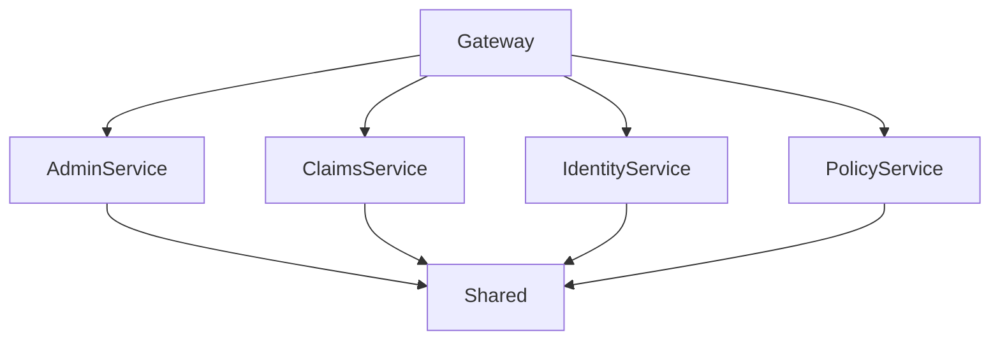
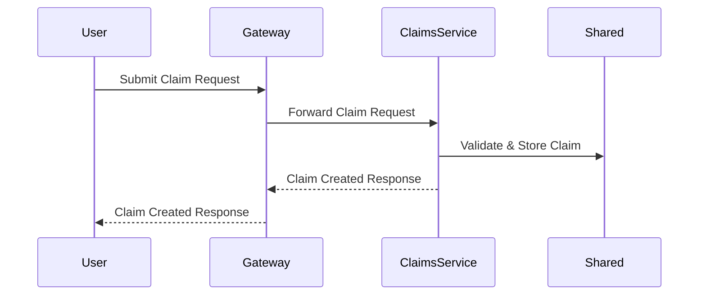
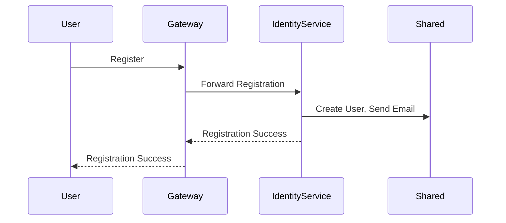
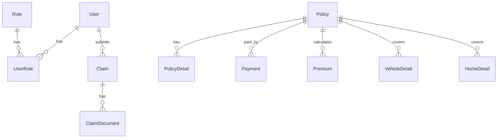

# SmartSure Backend High-Level Design (HLD)

## 1. System Architecture

**SmartSure** uses a microservices architecture for modularity, scalability, and maintainability. The main backend components are:

- **Gateway** (API Gateway)
- **AdminService**
- **ClaimsService**
- **IdentityService**
- **PolicyService**
- **Shared Library**

### Architecture Diagram

Below is a Mermaid diagram representing the backend architecture:

---

## 1.1 Technology Stack

- **Backend Framework:** .NET 7 (C#)
- **API Gateway:** Ocelot
- **Database:** SQL Server (Entity Framework Core ORM)
- **Messaging:** RabbitMQ (for event-driven communication)
- **Authentication:** JWT Bearer Tokens
- **Other Integrations:** Razorpay (payments), SMTP (email)

---

## 2. Component Details

### 2.1 Gateway (SmartSure.Gateway)
- **Role:** Entry point for all client requests. Uses Ocelot for routing to backend services.
- **Key Configs:** `ocelot.json` (routes), `appsettings.json` (env config)
- **Startup:** `Program.cs`

### 2.2 AdminService
- **Role:** Admin dashboard, reports, audit logs.
- **Controllers:** `AdminController.cs`
- **Services:** `AdminService.cs`
- **Repositories:** `AdminRepository.cs`
- **Models:** `AuditLog.cs`, `Report.cs`

### 2.3 ClaimsService
- **Role:** Insurance claim management (creation, review, docs).
- **Controllers:** `ClaimsController.cs`
- **Services:** `ClaimService.cs`, `ClaimAdminService.cs`, `ClaimEventPublisher.cs`
- **Repositories:** `ClaimRepository.cs`
- **Models:** `Claim.cs`, `ClaimDocument.cs`, `ClaimStatusHistory.cs`
- **Uploads:** Document storage for claims

### 2.4 IdentityService
- **Role:** Authentication, authorization, user/role management.
- **Controllers:** `AuthController.cs`, `UsersController.cs`
- **Services:** `AuthService.cs`, `UserAdministrationService.cs`, `EmailService.cs`, `GoogleAuthService.cs`
- **Repositories:** `UserRepository.cs`, `RoleRepository.cs`
- **Models:** `User.cs`, `Role.cs`, `UserRole.cs`, `Password.cs`, `PasswordResetToken.cs`

### 2.5 PolicyService
- **Role:** Insurance products, policy management, premium calculation, payments.
- **Controllers:** `PoliciesController.cs`
- **Services:** `PolicyService.cs`, `RazorpayService.cs`, `PolicyEventPublisher.cs`
- **Repositories:** `PolicyRepository.cs`
- **Models:** `Policy.cs`, `PolicyDetail.cs`, `Premium.cs`, `Payment.cs`, `InsuranceType.cs`, `InsuranceSubType.cs`, `VehicleDetail.cs`, `HomeDetail.cs`

### 2.6 Shared Library (SmartSure.Shared)
- **Purpose:** Common code and contracts for all services.
- **Key Areas:**
  - **DTOs:** `ApiResponse.cs`
  - **Events:** `ClaimApprovedEvent.cs`, `ClaimRejectedEvent.cs`, `ClaimStatusChangedEvent.cs`, `ClaimSubmittedEvent.cs`, `PolicyActivatedEvent.cs`, `PolicyCancelledEvent.cs`, `UserRegisteredEvent.cs`
  - **Messaging:** `RabbitMqOptions.cs`
  - **Middleware:** `GlobalExceptionHandlerMiddleware.cs`
  - **Exceptions:** `BusinessRuleException.cs`, `ConflictException.cs`, `ForbiddenException.cs`, `HttpServiceException.cs`, `NotFoundException.cs`, `SmartSureException.cs`, `UnauthorizedException.cs`, `ValidationException.cs`
  - **Constants:** `ClaimStatus.cs`, `PolicyStatus.cs`, `Roles.cs`
  - **Extensions:** `MiddlewareExtensions.cs`, `SerilogExtensions.cs`

### 2.7 External Integrations

- **Razorpay:** Used by PolicyService for payment processing.
- **SMTP/Email:** Used by IdentityService for notifications and password resets.
- **RabbitMQ:** Used for event publishing and consumption between services.

---

## 3. Interactions

- **Gateway** routes all client requests to the appropriate microservice.
- Each service manages its own data and business logic.
- **Shared** library provides common contracts, events, and middleware.
- Services communicate via REST and publish/consume events (RabbitMQ).

---

## 4. Key Flows (Sequence Diagrams)

### 4.1 Claim Submission Flow

### 4.2 User Registration Flow

---

## 5. Security & Authentication

- **Authentication:** JWT tokens issued by IdentityService, validated by Gateway and downstream services.
- **Authorization:** Role-based (see Shared/Constants/Roles.cs).
- **Exception Handling:** Centralized via GlobalExceptionHandlerMiddleware.
- **Input Validation:** DTOs and validation exceptions.
- **Sensitive Data:** Passwords hashed, tokens securely generated.

---

## 6. Entity Relationship Diagram (ERD)

---

## 7. API Endpoint Summaries

### 7.1 AdminService
- `GET /api/admin/dashboard` - Get dashboard stats
- `GET /api/admin/reports` - Get reports
- `GET /api/admin/audit-logs` - Get audit logs

### 7.2 ClaimsService
- `POST /api/claims` - Submit a new claim
- `GET /api/claims/{id}` - Get claim details
- `POST /api/claims/{id}/documents` - Upload claim documents
- `GET /api/claims` - List all claims

### 7.3 IdentityService
- `POST /api/auth/login` - User login
- `POST /api/auth/register` - User registration
- `POST /api/auth/forgot-password` - Request password reset
- `POST /api/auth/reset-password` - Reset password
- `GET /api/users/{id}` - Get user profile

### 7.4 PolicyService
- `GET /api/policies` - List policies
- `POST /api/policies` - Purchase policy
- `GET /api/policies/{id}` - Get policy details
- `POST /api/policies/{id}/pay` - Make payment

---
