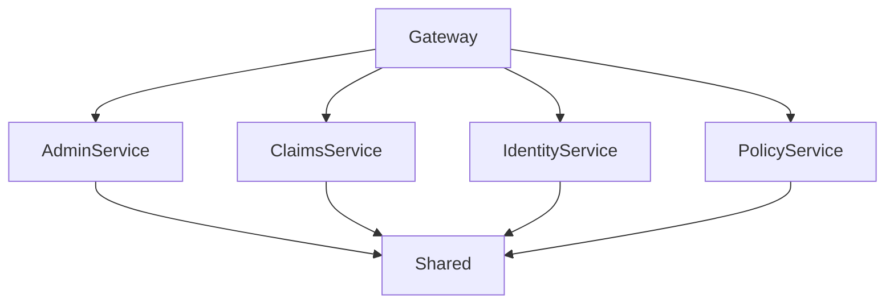

# SmartSure Backend Low-Level Design (LLD)

## Overview
The SmartSure backend is a microservices-based architecture for an insurance operations platform. It consists of the following main components:
- **Gateway**: API gateway for routing and aggregation
- **AdminService**: Handles admin operations (dashboard, reports, audit logs)
- **ClaimsService**: Manages insurance claims
- **IdentityService**: Handles authentication, authorization, and user management
- **PolicyService**: Manages insurance policies and products
- **Shared**: Shared code (DTOs, events, exceptions, middleware, etc.)

---

## 1. Gateway (SmartSure.Gateway)
- **Purpose**: Entry point for all client requests; routes requests to appropriate services using Ocelot.
- **Key files**:
  - Program.cs: App startup and configuration
  - ocelot.json: Routing rules for microservices
  - appsettings.json: Environment configuration

---

## 2. AdminService (SmartSure.AdminService)
- **Purpose**: Provides admin features like dashboard stats, reports, and audit logs.
- **Key folders**:
  - Controllers/: API endpoints for admin features
  - Services/: Business logic for admin operations
  - Repositories/: Data access for admin data
  - DTOs/: Data transfer objects for admin APIs
  - Models/: Entity models
  - Data/: Database context and migrations

---

## 3. ClaimsService (SmartSure.ClaimsService)
- **Purpose**: Handles insurance claim creation, submission, review, and document management.
- **Key folders**:
  - Controllers/: Endpoints for claims
  - Services/: Claim business logic
  - Repositories/: Data access for claims
  - DTOs/: Data transfer objects for claims
  - Models/: Claim entities
  - Data/: Database context and migrations
  - uploads/: Storage for claim documents

---

## 4. IdentityService (SmartSure.IdentityService)
- **Purpose**: Manages authentication, authorization, user registration, and roles.
- **Key folders**:
  - Controllers/: Endpoints for auth and user management
  - Services/: Auth and user logic
  - Repositories/: Data access for users/roles
  - DTOs/: Data transfer objects for identity
  - Models/: User and role entities
  - Data/: Database context and migrations
  - Helpers/: Utility classes for identity

---

## 5. PolicyService (SmartSure.PolicyService)
- **Purpose**: Manages insurance products, policy purchase, premium calculation, and payment integration.
- **Key folders**:
  - Controllers/: Endpoints for policies/products
  - Services/: Policy/product logic
  - Repositories/: Data access for policies/products
  - DTOs/: Data transfer objects for policies
  - Models/: Policy/product entities
  - Data/: Database context and migrations

---

## 6. Shared (SmartSure.Shared)
- **Purpose**: Contains code shared by all services.
- **Key folders**:
  - DTOs/: Shared data transfer objects
  - Events/: Integration events
  - Exceptions/: Custom exception types
  - Extensions/: Extension methods
  - Messaging/: Messaging infrastructure
  - Middleware/: Shared middleware
  - Constants/: Shared constants

---

## Interactions
- All client requests go through the Gateway, which routes to the appropriate service.
- Services communicate with their own databases and may publish/consume events via messaging (see Shared/Messaging).
- Shared code is referenced by all services for consistency.

---

## Diagram

---

This LLD provides a high-level structure and the main responsibilities of each backend component. For more details, see the code in each service's Controllers, Services, and Repositories folders.
