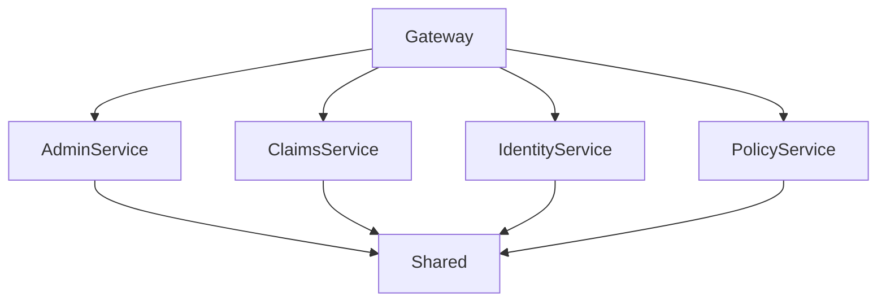
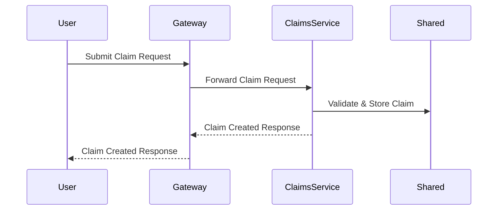
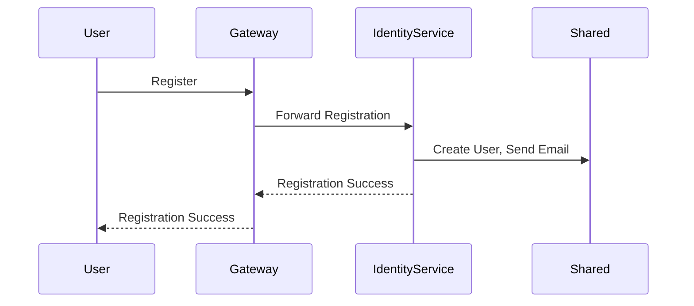
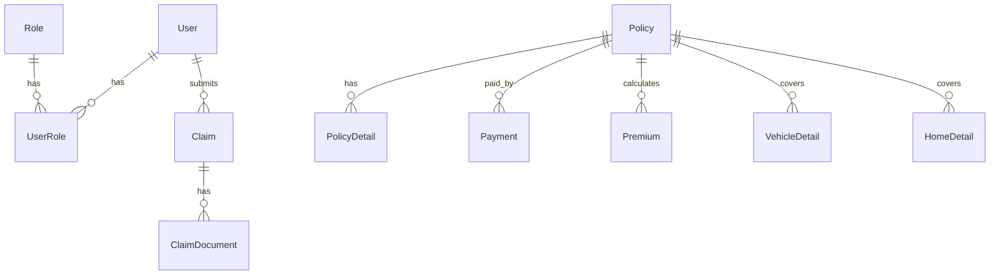

# SmartSure Backend Low-Level Design (LLD)

## Overview
The SmartSure backend is a microservices-based architecture for an insurance operations platform. It consists of the following main components:
- **Gateway**: API gateway for routing and aggregation
- **AdminService**: Handles admin operations (dashboard, reports, audit logs)
- **ClaimsService**: Manages insurance claims
- **IdentityService**: Handles authentication, authorization, and user management
- **PolicyService**: Manages insurance policies and products
- **Shared**: Shared code (DTOs, events, exceptions, middleware, etc.)

---

## 1. Gateway (SmartSure.Gateway)
- **Purpose**: Entry point for all client requests; routes requests to appropriate services using Ocelot.
- **Key files**:
  - Program.cs: App startup and configuration
  - ocelot.json: Routing rules for microservices
  - appsettings.json: Environment configuration

---

## 2. AdminService (SmartSure.AdminService)
- **Purpose**: Provides admin features like dashboard stats, reports, and audit logs.
- **Key folders**:
  - Controllers/: API endpoints for admin features
  - Services/: Business logic for admin operations
  - Repositories/: Data access for admin data
  - DTOs/: Data transfer objects for admin APIs
  - Models/: Entity models
  - Data/: Database context and migrations

---

## 3. ClaimsService (SmartSure.ClaimsService)
- **Purpose**: Handles insurance claim creation, submission, review, and document management.
- **Key folders**:
  - Controllers/: Endpoints for claims
  - Services/: Claim business logic
  - Repositories/: Data access for claims
  - DTOs/: Data transfer objects for claims
  - Models/: Claim entities
  - Data/: Database context and migrations
  - uploads/: Storage for claim documents

---

## 4. IdentityService (SmartSure.IdentityService)
- **Purpose**: Manages authentication, authorization, user registration, and roles.
- **Key folders**:
  - Controllers/: Endpoints for auth and user management
  - Services/: Auth and user logic
  - Repositories/: Data access for users/roles
  - DTOs/: Data transfer objects for identity
  - Models/: User and role entities
  - Data/: Database context and migrations
  - Helpers/: Utility classes for identity

---

## 5. PolicyService (SmartSure.PolicyService)
- **Purpose**: Manages insurance products, policy purchase, premium calculation, and payment integration.
- **Key folders**:
  - Controllers/: Endpoints for policies/products
  - Services/: Policy/product logic
  - Repositories/: Data access for policies/products
  - DTOs/: Data transfer objects for policies
  - Models/: Policy/product entities
  - Data/: Database context and migrations

---

## 6. Shared (SmartSure.Shared)
- **Purpose**: Contains code shared by all services.
- **Key folders**:
  - DTOs/: Shared data transfer objects
  - Events/: Integration events
  - Exceptions/: Custom exception types
  - Extensions/: Extension methods
  - Messaging/: Messaging infrastructure
  - Middleware/: Shared middleware
  - Constants/: Shared constants

---

## Interactions
- All client requests go through the Gateway, which routes to the appropriate service.
- Services communicate with their own databases and may publish/consume events via messaging (see Shared/Messaging).
- Shared code is referenced by all services for consistency.

---

## Diagram

---

## Technology Stack (Detailed)

- **Backend Framework:** .NET 7 (C#)
- **API Gateway:** Ocelot
- **Database:** SQL Server (Entity Framework Core ORM)
- **Messaging:** RabbitMQ (for event-driven communication)
- **Authentication:** JWT Bearer Tokens
- **Other Integrations:** Razorpay (payments), SMTP (email)

---

## Detailed Folder Structure & Key Classes

### 1. Gateway (SmartSure.Gateway)
- **Program.cs:** Configures Ocelot, logging, and service registration.
- **ocelot.json:** Defines routing rules for all microservices.
- **appsettings.json:** Environment-specific settings (connection strings, ports, etc).

### 2. AdminService (SmartSure.AdminService)
- **Controllers/AdminController.cs:** Exposes endpoints for dashboard, reports, audit logs.
- **Services/AdminService.cs:** Implements business logic for admin features.
- **Repositories/AdminRepository.cs:** Handles data access for admin data.
- **Models/AuditLog.cs, Report.cs:** Entity models for admin data.
- **DTOs/:** Data transfer objects for API communication.
- **Data/:** Entity Framework DbContext and migrations.

### 3. ClaimsService (SmartSure.ClaimsService)
- **Controllers/ClaimsController.cs:** Endpoints for claim operations.
- **Services/ClaimService.cs, ClaimAdminService.cs, ClaimEventPublisher.cs:** Business logic and event publishing for claims.
- **Repositories/ClaimRepository.cs:** Data access for claims.
- **Models/Claim.cs, ClaimDocument.cs, ClaimStatusHistory.cs:** Entity models for claims.
- **DTOs/:** Data transfer objects for claims.
- **uploads/:** Storage for claim-related documents.
- **Data/:** DbContext and migrations.

### 4. IdentityService (SmartSure.IdentityService)
- **Controllers/AuthController.cs, UsersController.cs:** Endpoints for authentication and user management.
- **Services/AuthService.cs, UserAdministrationService.cs, EmailService.cs, GoogleAuthService.cs:** Auth logic, user management, email, and Google OAuth.
- **Repositories/UserRepository.cs, RoleRepository.cs:** Data access for users and roles.
- **Models/User.cs, Role.cs, UserRole.cs, Password.cs, PasswordResetToken.cs:** Entity models for identity.
- **DTOs/:** Data transfer objects for identity.
- **Helpers/:** Utility classes for password hashing, token generation, etc.
- **Data/:** DbContext and migrations.

### 5. PolicyService (SmartSure.PolicyService)
- **Controllers/PoliciesController.cs:** Endpoints for policy and product management.
- **Services/PolicyService.cs, RazorpayService.cs, PolicyEventPublisher.cs:** Business logic, payment integration, event publishing.
- **Repositories/PolicyRepository.cs:** Data access for policies/products.
- **Models/Policy.cs, PolicyDetail.cs, Premium.cs, Payment.cs, InsuranceType.cs, InsuranceSubType.cs, VehicleDetail.cs, HomeDetail.cs:** Entity models for policies.
- **DTOs/:** Data transfer objects for policies.
- **Data/:** DbContext and migrations.

### 6. Shared (SmartSure.Shared)
- **DTOs/ApiResponse.cs:** Standard API response wrapper.
- **Events/:** Integration events (e.g., ClaimApprovedEvent, PolicyActivatedEvent).
- **Exceptions/:** Custom exception types for error handling.
- **Extensions/:** Extension methods for middleware, logging, etc.
- **Messaging/RabbitMqOptions.cs:** Messaging configuration.
- **Middleware/GlobalExceptionHandlerMiddleware.cs:** Centralized error handling.
- **Constants/:** Shared constants (roles, statuses).

---

## Key Flows (Sequence Diagrams)

### Claim Submission Flow

### User Registration Flow

---

## Security & Validation Details

- **Authentication:** JWT tokens issued by IdentityService, validated by Gateway and services.
- **Authorization:** Role-based (see Shared/Constants/Roles.cs).
- **Exception Handling:** Centralized via GlobalExceptionHandlerMiddleware.
- **Input Validation:** DTOs and validation exceptions.
- **Sensitive Data:** Passwords hashed, tokens securely generated.

---

## Entity Relationship Diagram (ERD)

---

## API Endpoint Summaries (Sample)

### AdminService
- `GET /api/admin/dashboard` - Get dashboard stats
- `GET /api/admin/reports` - Get reports
- `GET /api/admin/audit-logs` - Get audit logs

### ClaimsService
- `POST /api/claims` - Submit a new claim
- `GET /api/claims/{id}` - Get claim details
- `POST /api/claims/{id}/documents` - Upload claim documents
- `GET /api/claims` - List all claims

### IdentityService
- `POST /api/auth/login` - User login
- `POST /api/auth/register` - User registration
- `POST /api/auth/forgot-password` - Request password reset
- `POST /api/auth/reset-password` - Reset password
- `GET /api/users/{id}` - Get user profile

### PolicyService
- `GET /api/policies` - List policies
- `POST /api/policies` - Purchase policy
- `GET /api/policies/{id}` - Get policy details
- `POST /api/policies/{id}/pay` - Make payment

---
