# SmartSure Backend LLD Visual Diagram

Below is a visual low-level design (LLD) diagram for your backend architecture. You can view this diagram using a Mermaid.js viewer or compatible Markdown renderer.

```mermaid
flowchart TD
  Gateway[SmartSure.Gateway]
  AdminService[AdminService]
  ClaimsService[ClaimsService]
  IdentityService[IdentityService]
  PolicyService[PolicyService]
  Shared[SmartSure.Shared]

  Gateway --> AdminService
  Gateway --> ClaimsService
  Gateway --> IdentityService
  Gateway --> PolicyService
  AdminService --> Shared
  ClaimsService --> Shared
  IdentityService --> Shared
  PolicyService --> Shared

  subgraph AdminService
    AControllers[Controllers]
    AServices[Services]
    ARepositories[Repositories]
    AModels[Models]
    ADTOs[DTOs]
    AData[Data]
    AControllers --> AServices
    AServices --> ARepositories
    ARepositories --> AModels
    AServices --> ADTOs
    ARepositories --> AData
  end

  subgraph ClaimsService
    CControllers[Controllers]
    CServices[Services]
    CRepositories[Repositories]
    CModels[Models]
    CDTOs[DTOs]
    CData[Data]
    CControllers --> CServices
    CServices --> CRepositories
    CRepositories --> CModels
    CServices --> CDTOs
    CRepositories --> CData
  end

  subgraph IdentityService
    IControllers[Controllers]
    IServices[Services]
    IRepositories[Repositories]
    IModels[Models]
    IDTOs[DTOs]
    IData[Data]
    IControllers --> IServices
    IServices --> IRepositories
    IRepositories --> IModels
    IServices --> IDTOs
    IRepositories --> IData
  end

  subgraph PolicyService
    PControllers[Controllers]
    PServices[Services]
    PRepositories[Repositories]
    PModels[Models]
    PDTOs[DTOs]
    PData[Data]
    PControllers --> PServices
    PServices --> PRepositories
    PRepositories --> PModels
    PServices --> PDTOs
    PRepositories --> PData
  end
```

