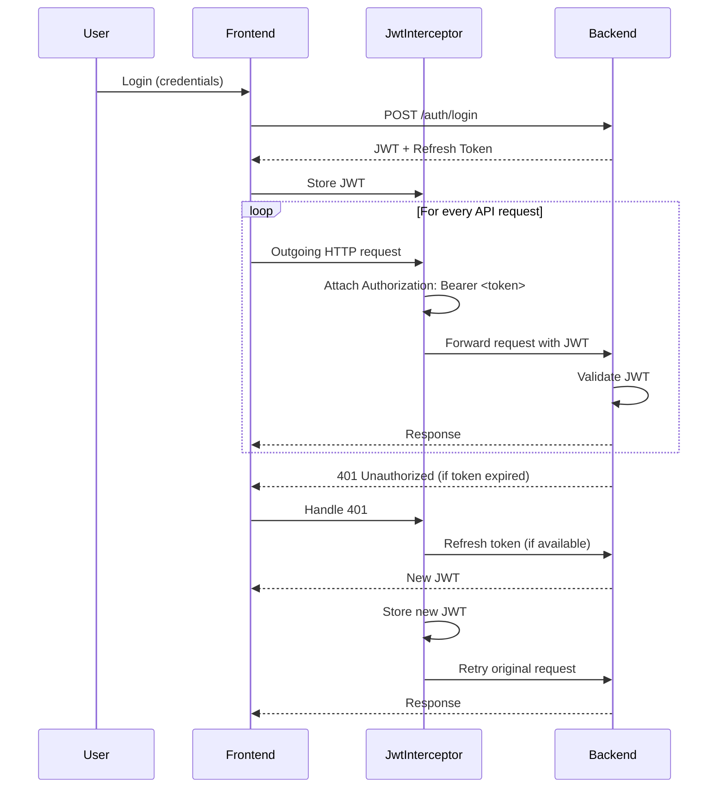

# JWT Flow in SmartSure Project

```mermaid
sequenceDiagram
    participant User
    participant Frontend
    participant JwtInterceptor
    participant Backend

    User->>Frontend: Login (credentials)
    Frontend->>Backend: POST /auth/login
    Backend-->>Frontend: JWT + Refresh Token
    Frontend->>JwtInterceptor: Store JWT
    loop For every API request
        Frontend->>JwtInterceptor: Outgoing HTTP request
        JwtInterceptor->>JwtInterceptor: Attach Authorization: Bearer <token>
        JwtInterceptor->>Backend: Forward request with JWT
        Backend->>Backend: Validate JWT
        Backend-->>Frontend: Response
    end
    Backend-->>Frontend: 401 Unauthorized (if token expired)
    Frontend->>JwtInterceptor: Handle 401
    JwtInterceptor->>Backend: Refresh token (if available)
    Backend-->>Frontend: New JWT
    JwtInterceptor->>JwtInterceptor: Store new JWT
    JwtInterceptor->>Backend: Retry original request
    Backend-->>Frontend: Response
```

This diagram shows how JWT authentication and refresh works in your project, from login to token validation and refresh.